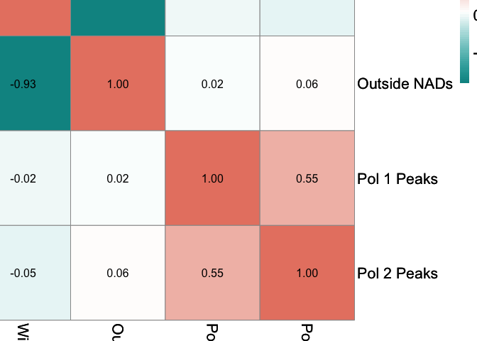
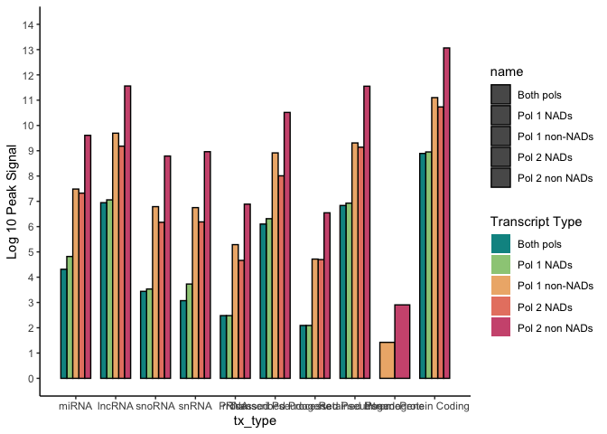
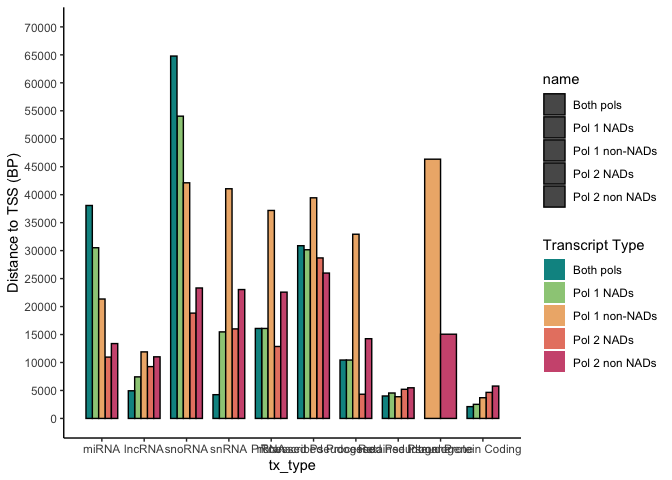

ChIP Reanalysis
================
Lucas Carter
2024-10-11

## ChIP Reanalysis for Figure Panel 6

This file contains the code necessary for generating the ChIP plots in
Figure Panel 6 that use intron coverage data from total RNAseq generated
for **“Extra-nucleolar Pol I regulates gene transcription through
chromatin domain maintenance”**. Publicly available [ChIP
data](https://www.ncbi.nlm.nih.gov/geo/query/acc.cgi?acc=GSE145874) were
taken from [Genome-wide analyses of chromatin interactions after the
loss of Pol I, Pol II, and Pol
III](https://genomebiology.biomedcentral.com/articles/10.1186/s13059-020-02067-3#availability-of-data-and-materials).
Mouse ESC NAD tracks were taken from [Genome-wide maps of nucleolus
interactions reveal distinct layers of repressive chromatin
domains](https://pubmed.ncbi.nlm.nih.gov/35304483/).

#### Load initial packages here

Loads initial packages and set root directory where dryad repository is
stored

``` r
## Set your root directory here
root<- "/Volumes/external hd/IBiS/Backman_Lab/Transcription Publication/repositories/dryad/"

## gene position directory
bed.dir <- "/ChIP/peaks/"

require("rtracklayer")
require("ggplot2")
require("GenomicRanges")
require("IRanges")
require("plyranges")
require("TxDb.Mmusculus.UCSC.mm39.refGene")
require("BSgenome.Mmusculus.UCSC.mm39")
require("org.Mm.eg.db")
require("ChIPseeker")
require("AnnotationHub")
require("corrplot")
require("pheatmap")
require("tidyr")
require("forcats")

chroms <- c("chr1", "chr2", "chr3", "chr4", "chr5", "chr6", "chr7", "chr8", "chr9", "chr10", "chr11", 
            "chr12", "chr13", "chr14", "chr15", "chr16", "chr17", "chr18", "chr19", "chrX", "chrM", "chrR")
```

#### Prepare data for plotting

``` r
##------------------------------Bedtools intersected replicates------------------------------##

pol1.bed <- read.table(file.path(root,bed.dir,"pol1.bedtools.union.bed"), sep= "\t", header= TRUE)
pol2.bed <- read.table(file.path(root,bed.dir,"pol2.bedtools.union.bed"), sep= "\t", header= TRUE)

pol1.bed <- GRanges(pol1.bed[,1:10])
pol2.bed <- GRanges(pol2.bed[,1:10])

##------------------------------Annotation of reps------------------------------##
## Annotate by genomic features like promoters, exons, etc

## Prepare annotation objects for mapping
ah <- AnnotationHub()
qcall <- query(ah, c("OrgDb","Mus musculus"))
hs <- ah[[names(qcall)]]
txdb_mm39 <- TxDb.Mmusculus.UCSC.mm39.refGene

## Make TX for all genomic features, including ncRNAs and lincRNAs 
library(GenomicFeatures)
txdb <- makeTxDbFromBiomart(dataset="mmusculus_gene_ensembl") ## Grab most recent ensembl data base
tx <- transcripts(txdb, columns=c("tx_name", "gene_id", "tx_type"))

## Convert TX to Genomic Ranges data
tx <- as.data.frame(tx)
tx <- tx %>% transform( seqnames= paste0("chr",tx$seqnames), start = tx$start, end = tx$end)  %>% as_granges()


## Annotate results. Packages introduced previously
annotate.peak <- function(peaks.file){
  
  ## Call annotation
  anno <- annotatePeak(peaks.file, TxDb = tx, tssRegion=c(-3000, 3000))
  anno@anno$symbol <- mapIds(hs, anno@anno$gene_id, column = "SYMBOL", keytype = "ENSEMBL")
  anno <- data.frame(anno@anno)
  
  ## Make a counts field
  anno$Count<- rep(1, nrow(anno))
  
  return(anno)
  
}

pol1.anno <- annotate.peak(pol1.bed)
```

    ## >> preparing features information...      2024-10-11 09:16:41 
    ## >> identifying nearest features...        2024-10-11 09:16:41

    ## >> calculating distance from peak to TSS...   2024-10-11 09:16:43 
    ## >> done...                    2024-10-11 09:16:43

``` r
pol2.anno <- annotate.peak(pol2.bed)
```

    ## >> preparing features information...      2024-10-11 09:16:43 
    ## >> identifying nearest features...        2024-10-11 09:16:43

    ## >> calculating distance from peak to TSS...   2024-10-11 09:16:45 
    ## >> done...                    2024-10-11 09:16:45

``` r
#####################################################################################
# Correlation analysis of genomic features                                
#####################################################################################

## For loop to generate 1 MB segments of the genome for counting overlaps in peaks
#Bins = 10k, 25k, 100k, and 1 MB
binGenome <- function(chrom.file="mm39.chrom.sizes.csv", bin.size, 
                      bed.dir = "/ChIP/chrom_sizes/",
                      chroms = c("chr1", "chr2", "chr3", "chr4", "chr5", "chr6", "chr7", "chr8", "chr9", "chr10", "chr11", 
                                 "chr12", "chr13", "chr14", "chr15", "chr16", "chr17", "chr18", "chr19", "chrX", "chrM", "chrR")){
  
  require(plyranges)
  require(dplyr)
  
  ## chrom sizes for mm10
  chrom.sizes <- read.table(file.path(root,bed.dir, chrom.file), sep= ",", header= T)
  
  ## Filter out chromosomes
  chrom.sizes <- chrom.sizes[chrom.sizes$name %in% chroms,]
  
  tbl <- data.frame()
  for (i in 1:length(chrom.sizes$name)){
    
    chrom <- chrom.sizes$name[i]

    
    if((chrom == "chrR" & bin.size > 15000 ) | ( chrom == "chrM" & bin.size > 15000)){
      
      x <-as.numeric(0)
      y <-as.numeric(chrom.sizes$size[i])
      
      name <- rep(chrom, length(x))
      
      df <- data.frame(name, x, y)

      
    } else {
      
      x <-as.numeric(seq(0,chrom.sizes$size[i], by = bin.size))
      
      y <-as.numeric(seq(bin.size,chrom.sizes$size[i], by = bin.size))
      y <- append(y, chrom.sizes$size[i], after = length(y))
      
      name <- rep(chrom, length(x))
      
      df <- data.frame(name, x, y)

      
    }
    
    tbl <- rbind(tbl,df)
    
  }
  
  ## Generate ranges from above
  tbl <- tbl %>% 
    transform( seqnames= paste0(tbl$name), start = tbl$x, end = tbl$y)  %>% 
    as_granges()
  
  return(tbl)
  
}

mm39.tbl <- binGenome("mm39.chrom.sizes.csv", 10000)
mm39.tbl
```

    ## GRanges object with 263213 ranges and 3 metadata columns:
    ##            seqnames      ranges strand |        name         x         y
    ##               <Rle>   <IRanges>  <Rle> | <character> <numeric> <numeric>
    ##        [1]     chr1     0-10000      * |        chr1         0     10000
    ##        [2]     chr1 10000-20000      * |        chr1     10000     20000
    ##        [3]     chr1 20000-30000      * |        chr1     20000     30000
    ##        [4]     chr1 30000-40000      * |        chr1     30000     40000
    ##        [5]     chr1 40000-50000      * |        chr1     40000     50000
    ##        ...      ...         ...    ... .         ...       ...       ...
    ##   [263209]     chrR     0-10000      * |        chrR         0     10000
    ##   [263210]     chrR 10000-20000      * |        chrR     10000     20000
    ##   [263211]     chrR 20000-30000      * |        chrR     20000     30000
    ##   [263212]     chrR 30000-40000      * |        chrR     30000     40000
    ##   [263213]     chrR 40000-45306      * |        chrR     40000     45306
    ##   -------
    ##   seqinfo: 22 sequences from an unspecified genome; no seqlengths

#### Figure 6F: Spearman correlation

``` r
#####################################################################################
# compositional analysis of NADs and rDNA # to be continued                         
#####################################################################################

# Set directory variables here
dir.nads <- "/ChIP/NADs"

NADs <- read.table(file.path(root,dir.nads, "NADsonly_mm39.csv"), sep= ",", header= F)
NADs <- NADs %>% transform( seqnames= V1, start = V2, end = V3)  %>% as_granges()

## Count overlaps of peaks within mouse for *selected genomic features*
nad.tbl <- mm39.tbl %>% mutate(non.nads_olap = count_overlaps(., mm39.tbl[!mm39.tbl %over% NADs,]),
                               nads_olap = count_overlaps(., mm39.tbl[mm39.tbl %over% NADs,]),
                               pol1_olap = count_overlaps(., pol1.bed),
                               pol2_olap = count_overlaps(., pol2.bed))

nad.tbl <- data.frame(nad.tbl)
nad.tbl$non.nads_olap<- ifelse(nad.tbl$non.nads_olap >1 , 1, nad.tbl$non.nads_olap)
nad.tbl$nads_olap<- ifelse(nad.tbl$nads_olap >1 , 1, nad.tbl$nads_olap)
nad.tbl$pol1_olap<- ifelse(nad.tbl$pol1_olap >1 , 1, nad.tbl$pol1_olap)
nad.tbl$pol2_olap<- ifelse(nad.tbl$pol2_olap >1 , 1, nad.tbl$pol2_olap)

## Prepare data for computing correlation
cor.tbl <- data.frame(nad.tbl)
rownames(cor.tbl) <- paste0(cor.tbl$seqnames, ": ", cor.tbl$start, "-", cor.tbl$end)
cor.tbl <- cor.tbl[,c(9:12)]

nrow(cor.tbl)
```

    ## [1] 263213

``` r
cor.tbl <- cor.tbl[ rowSums(cor.tbl) > 0, ]
nrow(cor.tbl)
```

    ## [1] 263213

``` r
## Non parametric Correlation test
M <- cor(cor.tbl, method="spearman") 

## heatmap of correlation coefficients
colors <- colorRampPalette(c("#009392", "white", "#e88471"))(64)

## Calculate correlation between pols across overlapping sections
p<-pheatmap(M, 
            color = colors,
            number_color = "black",
            fontsize = 16,
            fontsize_row = 16, 
            fontsize_col = 16,
            fontsize_number = 12,
            cellwidth = 100,
            cellheight = 100,
            cluster_cols= F,
            cluster_rows= F,
            display_numbers = T,
            labels_row = c("Within NADs", "Outside NADs", "Pol 1 Peaks", "Pol 2 Peaks"),
            labels_col = c("Within NADs", "Outside NADs", "Pol 1 Peaks", "Pol 2 Peaks"),
            main = "Spearman Correlation",
            annotation_legend = TRUE
)
p
```

<!-- -->

#### Figure 6E: Spearman correlation

``` r
#####################################################################################
# Plot features of NAD Pol overlaps                       
#####################################################################################

## For plotting pol signal in and outside of NADs
pol1.anno <- GRanges(pol1.anno)
pol2.anno <- GRanges(pol2.anno)

## Code to either calculate average distance or average signal 
sum_peaks <- function(table, name){
  
  labels <- c("miRNA", "lncRNA","snoRNA", "snRNA","rRNA", "processed_pseudogene", 
              "transcribed_processed_pseudogene","retained_intron", "pseudogene", "protein_coding")
  
  ## Summmarize
  final.tbl <- table %>% group_by(tx_type) %>% 
    summarise(sum = log(sum(signalValue))) %>% 
    mutate(name = rep(name, times = length(unique(tx_type)), 
                      length.out = length(unique(tx_type)), each = 1))
  
  
  ## Filter
  final.tbl <- final.tbl[final.tbl$tx_type %in%labels ,]
  final.tbl <- final.tbl %>% arrange(factor(tx_type, levels = labels))
  final.tbl$factor = seq(1,nrow(final.tbl), by =1)
  
  return(final.tbl)
}

## Count overlaps of peaks within mouse for *selected genomic features*
pol1.tbl <- pol1.anno %>% mutate(non.nads_olap = count_overlaps(., pol1.anno[!pol1.anno %over% NADs,]),
                                 nads_olap = count_overlaps(., pol1.anno[pol1.anno %over% NADs,]),
                                 pol2_olap = count_overlaps(., pol2.bed))

pol2.tbl <- pol2.anno %>% mutate(non.nads_olap = count_overlaps(., pol2.anno[!pol2.anno %over% NADs,]),
                                 nads_olap = count_overlaps(., pol2.anno[pol2.anno %over% NADs,]),
                                 pol1_olap = count_overlaps(., pol1.bed))

pol1.tbl <- as.data.frame(pol1.tbl)
pol2.tbl <- as.data.frame(pol2.tbl)

## Get peaks where both pols overlap a feature
pol1.nad.tbl <- pol1.tbl[pol1.tbl$nads_olap >0,]
pol1.non.tbl <- pol1.tbl[pol1.tbl$non.nads_olap >0,]
pol2.nad.tbl <- pol2.tbl[nad.tbl$nads_olap >0,]
pol2.non.tbl <- pol2.tbl[nad.tbl$non.nads_olap >0,]
both.nad.tbl <- pol1.tbl[pol1.tbl$nads_olap >0 & pol1.tbl$pol2_olap >0,]

pol2.non.tbl <- sum_peaks(pol2.non.tbl, "Pol 2 non NADs")
pol2.tbl <- sum_peaks(pol2.nad.tbl, "Pol 2 NADs")
pol1.tbl <- sum_peaks(pol1.nad.tbl, "Pol 1 NADs")
pol1.tbl.2 <- sum_peaks(pol1.non.tbl, "Pol 1 non-NADs")
both.tbl <- sum_peaks(both.nad.tbl, "Both pols")

tbl <- rbind(pol2.tbl, pol1.tbl, pol1.tbl.2, both.tbl, pol2.non.tbl)

#colors <- c("#009392","#39b185","#9ccb86","#e9e29c","#eeb479","#e88471","#cf597e")
colors <- c("#009392","#9ccb86","#eeb479","#e88471","#cf597e")

labels <- c("miRNA", "lncRNA","snoRNA", "snRNA","rRNA", "processed_pseudogene", 
            "transcribed_processed_pseudogene","retained_intron", "pseudogene", "protein_coding")

## Plot individual timepoints as a barplot
barplot <- tbl %>% 
  mutate(tx_type= fct_reorder(tx_type, factor)) %>% 
  ggplot(aes(x=tx_type, y=sum, fill=name, colour = name), group_by(tx_type)) +
  scale_y_continuous(name="Log 10 Peak Signal", breaks = c(seq(0,14, by =1)) ,limits=c(0, 14))+
  geom_bar(stat="identity", width=0.75, position = "dodge", alpha = 1) +
  theme(axis.text.x = element_text(angle = 45,  hjust=1))+
  scale_color_manual(values=c("black","black","black","black","black"))+
  scale_fill_manual(values=colors) + theme_classic()+
  scale_x_discrete(limits = labels, labels = c("miRNA", "lncRNA","snoRNA", "snRNA","rRNA", "Processed Pseudogene", 
                                               "Transcribed Processed Pseudogene","Retained Intron", "Pseudogene", "Protein Coding"), expand = c(0.09, 0.09))+
  guides(fill = guide_legend(title = "Transcript Type")) 

barplot
```

<!-- -->

``` r
## Code to either calculate average distance or average signal 
sum_peaks <- function(table, name){
  
  labels <- c("miRNA", "lncRNA","snoRNA", "snRNA","rRNA", "processed_pseudogene", 
              "transcribed_processed_pseudogene","retained_intron", "pseudogene", "protein_coding")
  
  ## Summmarize
  final.tbl <- table %>% group_by(tx_type) %>% 
    mutate(distanceToTSS = ifelse(distanceToTSS == 0 , 1, abs(distanceToTSS))) %>% 
    summarise(sum = mean(distanceToTSS),.groups = 'keep') %>% 
    mutate(name = rep(name, times = length(unique(tx_type)), 
                      length.out = length(unique(tx_type)), each = 1))
  
  
  ## Filter
  final.tbl <- final.tbl[final.tbl$tx_type %in%labels ,]
  final.tbl <- final.tbl %>% arrange(factor(tx_type, levels = labels))
  final.tbl$factor = seq(1,nrow(final.tbl), by =1)
  
  return(final.tbl)
}

## Count overlaps of peaks within mouse for *selected genomic features*
pol1.tbl <- pol1.anno %>% mutate(non.nads_olap = count_overlaps(., pol1.anno[!pol1.anno %over% NADs,]),
                                 nads_olap = count_overlaps(., pol1.anno[pol1.anno %over% NADs,]),
                                 pol2_olap = count_overlaps(., pol2.bed))

pol2.tbl <- pol2.anno %>% mutate(non.nads_olap = count_overlaps(., pol2.anno[!pol2.anno %over% NADs,]),
                                 nads_olap = count_overlaps(., pol2.anno[pol2.anno %over% NADs,]),
                                 pol1_olap = count_overlaps(., pol1.bed))

pol1.tbl <- as.data.frame(pol1.tbl)
pol2.tbl <- as.data.frame(pol2.tbl)

## Get peaks where both pols overlap a feature
pol1.nad.tbl <- pol1.tbl[pol1.tbl$nads_olap >0,]
pol1.non.tbl <- pol1.tbl[pol1.tbl$non.nads_olap >0,]
pol2.nad.tbl <- pol2.tbl[nad.tbl$nads_olap >0,]
pol2.non.tbl <- pol2.tbl[nad.tbl$non.nads_olap >0,]
both.nad.tbl <- pol1.tbl[pol1.tbl$nads_olap >0 & pol1.tbl$pol2_olap >0,]

pol2.non.tbl <- sum_peaks(pol2.non.tbl, "Pol 2 non NADs")
pol2.tbl <- sum_peaks(pol2.nad.tbl, "Pol 2 NADs")
pol1.tbl <- sum_peaks(pol1.nad.tbl, "Pol 1 NADs")
pol1.tbl.2 <- sum_peaks(pol1.non.tbl, "Pol 1 non-NADs")
both.tbl <- sum_peaks(both.nad.tbl, "Both pols")

tbl <- rbind(pol2.tbl, pol1.tbl, pol1.tbl.2, both.tbl, pol2.non.tbl)

## Plot individual timepoints as a barplot
barplot <- tbl %>% 
  mutate(tx_type= fct_reorder(tx_type, factor)) %>% 
  ggplot(aes(x=tx_type, y=sum, fill=name, colour = name), group_by(tx_type)) +
  scale_y_continuous(name="Distance to TSS (BP)", breaks = c(seq(0,70000, by =5000)) ,limits=c(0, 70000))+
  geom_bar(stat="identity", width=0.75, position = "dodge", alpha = 1) +
  theme(axis.text.x = element_text(angle = 45,  hjust=1))+
  scale_color_manual(values=c("black","black","black","black","black"))+
  scale_fill_manual(values=colors) + theme_classic()+
  scale_x_discrete(limits = labels, labels = c("miRNA", "lncRNA","snoRNA", "snRNA","rRNA", "Processed Pseudogene", 
                                               "Transcribed Processed Pseudogene","Retained Intron", "Pseudogene", "Protein Coding"), expand = c(0.09, 0.09))+
  guides(fill = guide_legend(title = "Transcript Type")) 

barplot
```

<!-- -->

``` r
utils::sessionInfo()
```

    ## R version 4.3.3 (2024-02-29)
    ## Platform: x86_64-apple-darwin20 (64-bit)
    ## Running under: macOS Sonoma 14.2.1
    ## 
    ## Matrix products: default
    ## BLAS:   /Library/Frameworks/R.framework/Versions/4.3-x86_64/Resources/lib/libRblas.0.dylib 
    ## LAPACK: /Library/Frameworks/R.framework/Versions/4.3-x86_64/Resources/lib/libRlapack.dylib;  LAPACK version 3.11.0
    ## 
    ## locale:
    ## [1] en_US.UTF-8/en_US.UTF-8/en_US.UTF-8/C/en_US.UTF-8/en_US.UTF-8
    ## 
    ## time zone: America/Los_Angeles
    ## tzcode source: internal
    ## 
    ## attached base packages:
    ## [1] stats4    stats     graphics  grDevices utils     datasets  methods  
    ## [8] base     
    ## 
    ## other attached packages:
    ##  [1] dplyr_1.1.4                            
    ##  [2] forcats_1.0.0                          
    ##  [3] tidyr_1.3.1                            
    ##  [4] pheatmap_1.0.12                        
    ##  [5] corrplot_0.94                          
    ##  [6] AnnotationHub_3.10.1                   
    ##  [7] BiocFileCache_2.10.2                   
    ##  [8] dbplyr_2.5.0                           
    ##  [9] ChIPseeker_1.38.0                      
    ## [10] TxDb.Mmusculus.UCSC.mm39.refGene_3.18.0
    ## [11] GenomicFeatures_1.54.4                 
    ## [12] AnnotationDbi_1.64.1                   
    ## [13] Biobase_2.62.0                         
    ## [14] plyranges_1.22.0                       
    ## [15] ggplot2_3.5.1                          
    ## [16] rtracklayer_1.62.0                     
    ## [17] GenomicRanges_1.54.1                   
    ## [18] GenomeInfoDb_1.38.8                    
    ## [19] IRanges_2.36.0                         
    ## [20] S4Vectors_0.40.2                       
    ## [21] BiocGenerics_0.48.1                    
    ## 
    ## loaded via a namespace (and not attached):
    ##   [1] splines_4.3.3                          
    ##   [2] later_1.3.2                            
    ##   [3] BiocIO_1.12.0                          
    ##   [4] bitops_1.0-9                           
    ##   [5] ggplotify_0.1.2                        
    ##   [6] filelock_1.0.3                         
    ##   [7] tibble_3.2.1                           
    ##   [8] polyclip_1.10-7                        
    ##   [9] XML_3.99-0.17                          
    ##  [10] lifecycle_1.0.4                        
    ##  [11] lattice_0.22-6                         
    ##  [12] MASS_7.3-60.0.1                        
    ##  [13] magrittr_2.0.3                         
    ##  [14] rmarkdown_2.28                         
    ##  [15] yaml_2.3.10                            
    ##  [16] plotrix_3.8-4                          
    ##  [17] httpuv_1.6.15                          
    ##  [18] cowplot_1.1.3                          
    ##  [19] DBI_1.2.3                              
    ##  [20] RColorBrewer_1.1-3                     
    ##  [21] abind_1.4-8                            
    ##  [22] zlibbioc_1.48.2                        
    ##  [23] purrr_1.0.2                            
    ##  [24] ggraph_2.2.1                           
    ##  [25] RCurl_1.98-1.16                        
    ##  [26] yulab.utils_0.1.7                      
    ##  [27] tweenr_2.0.3                           
    ##  [28] rappdirs_0.3.3                         
    ##  [29] GenomeInfoDbData_1.2.11                
    ##  [30] enrichplot_1.22.0                      
    ##  [31] ggrepel_0.9.6                          
    ##  [32] tidytree_0.4.6                         
    ##  [33] codetools_0.2-20                       
    ##  [34] DelayedArray_0.28.0                    
    ##  [35] DOSE_3.28.2                            
    ##  [36] xml2_1.3.6                             
    ##  [37] ggforce_0.4.2                          
    ##  [38] tidyselect_1.2.1                       
    ##  [39] aplot_0.2.3                            
    ##  [40] farver_2.1.2                           
    ##  [41] viridis_0.6.5                          
    ##  [42] matrixStats_1.4.1                      
    ##  [43] GenomicAlignments_1.38.2               
    ##  [44] jsonlite_1.8.9                         
    ##  [45] tidygraph_1.3.1                        
    ##  [46] tools_4.3.3                            
    ##  [47] progress_1.2.3                         
    ##  [48] treeio_1.26.0                          
    ##  [49] TxDb.Hsapiens.UCSC.hg19.knownGene_3.2.2
    ##  [50] Rcpp_1.0.13                            
    ##  [51] glue_1.8.0                             
    ##  [52] gridExtra_2.3                          
    ##  [53] SparseArray_1.2.4                      
    ##  [54] xfun_0.48                              
    ##  [55] qvalue_2.34.0                          
    ##  [56] MatrixGenerics_1.14.0                  
    ##  [57] withr_3.0.1                            
    ##  [58] BiocManager_1.30.25                    
    ##  [59] fastmap_1.2.0                          
    ##  [60] boot_1.3-31                            
    ##  [61] fansi_1.0.6                            
    ##  [62] caTools_1.18.3                         
    ##  [63] digest_0.6.37                          
    ##  [64] R6_2.5.1                               
    ##  [65] mime_0.12                              
    ##  [66] gridGraphics_0.5-1                     
    ##  [67] colorspace_2.1-1                       
    ##  [68] GO.db_3.18.0                           
    ##  [69] gtools_3.9.5                           
    ##  [70] biomaRt_2.58.2                         
    ##  [71] RSQLite_2.3.7                          
    ##  [72] utf8_1.2.4                             
    ##  [73] generics_0.1.3                         
    ##  [74] data.table_1.16.2                      
    ##  [75] prettyunits_1.2.0                      
    ##  [76] graphlayouts_1.2.0                     
    ##  [77] httr_1.4.7                             
    ##  [78] S4Arrays_1.2.1                         
    ##  [79] scatterpie_0.2.4                       
    ##  [80] pkgconfig_2.0.3                        
    ##  [81] gtable_0.3.5                           
    ##  [82] blob_1.2.4                             
    ##  [83] XVector_0.42.0                         
    ##  [84] shadowtext_0.1.4                       
    ##  [85] htmltools_0.5.8.1                      
    ##  [86] fgsea_1.28.0                           
    ##  [87] scales_1.3.0                           
    ##  [88] png_0.1-8                              
    ##  [89] ggfun_0.1.6                            
    ##  [90] knitr_1.48                             
    ##  [91] rstudioapi_0.16.0                      
    ##  [92] reshape2_1.4.4                         
    ##  [93] rjson_0.2.23                           
    ##  [94] nlme_3.1-166                           
    ##  [95] curl_5.2.3                             
    ##  [96] cachem_1.1.0                           
    ##  [97] stringr_1.5.1                          
    ##  [98] BiocVersion_3.18.1                     
    ##  [99] KernSmooth_2.23-24                     
    ## [100] parallel_4.3.3                         
    ## [101] HDO.db_0.99.1                          
    ## [102] restfulr_0.0.15                        
    ## [103] pillar_1.9.0                           
    ## [104] grid_4.3.3                             
    ## [105] vctrs_0.6.5                            
    ## [106] gplots_3.2.0                           
    ## [107] promises_1.3.0                         
    ## [108] xtable_1.8-4                           
    ## [109] evaluate_1.0.1                         
    ## [110] cli_3.6.3                              
    ## [111] compiler_4.3.3                         
    ## [112] Rsamtools_2.18.0                       
    ## [113] rlang_1.1.4                            
    ## [114] crayon_1.5.3                           
    ## [115] plyr_1.8.9                             
    ## [116] fs_1.6.4                               
    ## [117] stringi_1.8.4                          
    ## [118] viridisLite_0.4.2                      
    ## [119] BiocParallel_1.36.0                    
    ## [120] munsell_0.5.1                          
    ## [121] Biostrings_2.70.3                      
    ## [122] lazyeval_0.2.2                         
    ## [123] GOSemSim_2.28.1                        
    ## [124] Matrix_1.6-5                           
    ## [125] hms_1.1.3                              
    ## [126] patchwork_1.3.0                        
    ## [127] bit64_4.5.2                            
    ## [128] KEGGREST_1.42.0                        
    ## [129] shiny_1.9.1                            
    ## [130] SummarizedExperiment_1.32.0            
    ## [131] interactiveDisplayBase_1.40.0          
    ## [132] highr_0.11                             
    ## [133] igraph_2.0.3                           
    ## [134] memoise_2.0.1                          
    ## [135] ggtree_3.10.1                          
    ## [136] fastmatch_1.1-4                        
    ## [137] bit_4.5.0                              
    ## [138] ape_5.8
