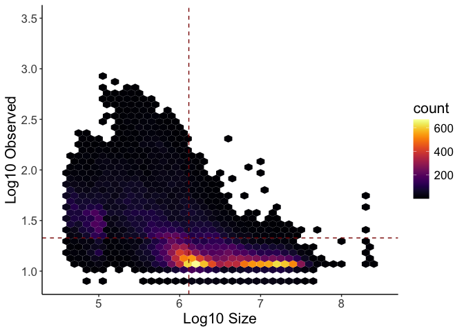

HiC
================
Lucas Carter
2024-10-09

## HiC Figure Panel 4

This file contains the code necessary for generating the figures in
Figure Panel 4 that use HiC data from **“Extra-nucleolar Pol I regulates
gene transcription through chromatin domain maintenance”**.

#### Load initial packages here

Loads initial packages and set root directory where dryad repository is
stored

``` r
# upregulated color: "#D46780"
# downregulated color: "#798234"

rm(list = ls())
gc()
```

    ##          used (Mb) gc trigger (Mb) limit (Mb) max used (Mb)
    ## Ncells 479146 25.6    1034225 55.3         NA   669525 35.8
    ## Vcells 897752  6.9    8388608 64.0     153600  1852051 14.2

``` r
## Directories
## Set your root directory here
root<- "/Volumes/external hd/IBiS/Backman_Lab/Transcription Publication/repositories/dryad/"
## define repeat variables
dir.loop <- "HiC/loop_analysis/"

# import packages
require("ggplot2")
require("dplyr")
require("magrittr")
require("tximport")
require("forcats")
require("pheatmap")
require("viridis")
require("tidyr")
require("ggpubr")
require("ggridges")
require("ggside")
require("plyr")
```

#### Load functions

``` r
## Function to get loop data and plot loop strength vs loop size
plotLoops <- function(exps, dir.loop,cond){
  
  require(plyranges)
  require(dplyr)
  require(ggside)
  require(ggplot2)
  
  ## Read loops in and transform
  loops <- as.data.frame(read.table(file.path(root, dir.loop,exps[1],"merged_loops.bedpe"), sep= "\t", header= F))
  loops <- loops %>% transform( seqnames= paste0("chr",V1), start = V2, end = V6, size = abs(V6-V2))
  
  ## Filter dups
  loops <- loops  %>% dplyr::mutate(dups = paste0(V1, "_", V2, "_",V6)) %>% dplyr::distinct(dups, .keep_all = T) ## Filter dups
  loops$cond <- rep(cond, nrow(loops))
  loops <- loops  %>% dplyr::select(seqnames, start, end, size, V12, cond)
  
  ## Plot loop size vs loop strength
  p<- ggplot(loops, aes(x=log10(size), y=log10(V12)) ) +
    geom_hex(bins = 40) +scale_y_continuous(limits = c(0.9,3.5))+scale_x_continuous(limits = c(4.5,8.5))+ 
    geom_hline(yintercept=mean(log10(loops$V12)), col="darkred", lty = "dashed") + geom_vline(xintercept=mean(log10(loops$size)), col="darkred", lty = "dashed") +
    scale_fill_viridis( option = "B")+ theme_classic()+
    theme(plot.title = element_text(size=16), text = element_text(size=16, family="Arial"), axis.text.x = element_text(angle = 0)) +
    xlab("Log10 Size")+ ylab("Log10 Observed") 
  p+ geom_xsidedensity(aes(y=after_stat(density), alpha=0.7, xfill = cond), position = "dodge") +
    geom_ysidedensity(aes(x=after_stat(density), alpha=0.7, yfill = cond), position = "dodge")+
    scale_xfill_manual(values =  c("#000004")) +
    scale_yfill_manual(values =  c("#000004")) + theme(ggside.panel.scale = .2)+
    scale_xsidey_continuous() + scale_ysidex_continuous() 
  
  print(p)
  
}

## Function to gather loop data 
getLoops <- function(exps, dir.loop,cond){
  
  require(plyranges)
  require(dplyr)
  
  ## Read loops in and transform
  loops <- as.data.frame(read.table(file.path(root, dir.loop,exps[1],"merged_loops.bedpe"), sep= "\t", header= F))
  loops <- loops %>% transform( seqnames= paste0("chr",V1), start = V2, end = V6, size = abs(V6-V2))
  
  ## Filter dups
  loops <- loops  %>% dplyr::mutate(dups = paste0(V1, "_", V2, "_",V6)) %>% dplyr::distinct(dups, .keep_all = T) ## Filter dups
  loops$cond <- rep(cond, nrow(loops))
  loops <- loops  %>% dplyr::select(seqnames, start, end, size, V12, cond)

  return(loops)
  
}

## Tiling function
Tile <- function(x, quantile){
  
  require(dplyr)
  
  bin <- seq(0,quantile,1)
  
  x <- x %>% mutate(bin = ntile(log10(size), as.numeric(quantile)))
  n <- x %>% group_by(bin) %>% reframe(mean.obs = round(mean(log10(size)), 3))
  x$binN <- cut(x$bin, breaks = bin,labels = n$mean.obs)
  
  x <- x %>% group_by(binN, cond)%>% reframe(obs = mean(log10(V12)))
  
  return(x)
  
}

## Function to calculate CDF values for plotting
CDF_X <- function (x, name) {
  
  x <- sort(x)
  n <- length(x)

  if (n < 1) 
    stop("'x' must have 1 or more non-missing values")
  
  vals <- unique(x)
  sums <- cumsum(tabulate(match(x, vals)))/n
  
  cdf <- data.frame(vals, sums)
  cdf$name<- rep(name, nrow(cdf))
  colnames(cdf) <- c("values", "cumsums", "name")
  
  return(cdf)
}
```

#### Figure 4A-C: Plot loop characteristics

Here, we plot the observed strength of loops versus their size.

``` r
## define repeat variables
dir.loop <- "HiC/loop_analysis/"
exps <- c("WT_HCT116_CTRL","Pol1_6hrs_Aux","Pol2_6hrs_Aux", "1hr_ActD")

wt.loops <- plotLoops(exps = exps[1], dir.loop = dir.loop, cond = "WT")
```

<!-- -->

``` r
p1.loops <- plotLoops(exps = exps[2], dir.loop = dir.loop, cond = "Pol1")
```

<!-- -->

``` r
p2.loops <- plotLoops(exps = exps[3], dir.loop = dir.loop, cond = "Pol2")
```

<!-- -->

``` r
actd.loops <- plotLoops(exps = exps[4], dir.loop = dir.loop, cond = "ActD")
```

<!-- -->

#### Figure 4E: Plot loop characteristics as heatmap

Here, we plot the observed strength of loops versus their size as a
binned heatmap to better visualize the relationship between each
condition.

``` r
wt.loops <- getLoops(exps = exps[1], dir.loop = dir.loop, cond = "WT")
p1.loops <- getLoops(exps = exps[2], dir.loop = dir.loop, cond = "Pol1")
p2.loops <- getLoops(exps = exps[3], dir.loop = dir.loop, cond = "Pol2")
actd.loops <- getLoops(exps = exps[4], dir.loop = dir.loop, cond = "ActD")

##-------------------------------------------------------## Tile data and plot dist vs obs

## Group data and bin
loop.df <- rbind(p2.loops, wt.loops, p1.loops)
group<- Tile(loop.df , 8)

## get conditon labels
cond <- dput(unique(loop.df$cond))
```

    ## c("Pol2", "WT", "Pol1")

``` r
## reshape data
df.dist <- data.frame(bin = unique(group$binN))
for (c in 1:length(cond)) {
  c <- cond[c]
  x <- group[group$cond == c,]
  cat(paste0(" adding condition : ", c, "\n"))
  df.dist <- cbind(df.dist, obs = as.numeric(x$obs))
}
```

    ##  adding condition : Pol2
    ##  adding condition : WT
    ##  adding condition : Pol1

``` r
## Prepapre for plotting
colnames(df.dist) <- c("bins","Pol2: all", "WT: all", "Pol1: all")
rownames <- unique(group$binN)
df.dist <- df.dist[,-c(1)]

colors <- colorRampPalette(c("#798234","white","#D46780"))(64)

## Get heatmap of distance data ## decile.heatmap.allcounts ## decile.heatmap.pol1.lfc.up ## decile.heatmap.pol1.lfc.dn ## decile.heatmap.actd.lfc.dn ## decile.heatmap.actd.lfc.up
pheatmap(df.dist, display_numbers = T, number_color = "black", color = colors,
         labels_row = rownames, cellwidth = 25, cellheight = 25,
         fontsize_number = 8,  cluster_rows = FALSE,  cluster_cols = T, 
         main = "Loop Strength Binned by Loop Size")
```

<!-- -->

#### Figure 4F: Plot Distal-to-Local ratio

We took advantage of compaction analysis borrowed from [Transcription
Elongation Can Affect Genome 3D
Structure](https://pubmed.ncbi.nlm.nih.gov/30146161/) where the change
in contacts is calculated for a given bin below 1e6 BP and over 1e6 BP.
‘rat.1mbp.inf.allconds.csv’ was generated using custom Compaction.R
script.

``` r
## Condition labels
exps <- c("WT_HCT116_CTRL", "Pol1_6hrs_Aux", "Pol2_6hrs_Aux",  "1hr_ActD")

dir.dtl <- "HiC/DTL_analysis/"
tbl <- read.table(file.path(root, dir.dtl, "rat.1mbp.inf.allconds.csv"), header = T, sep = ",")

## Gather and count number of log2 points 
ko_tbl <- tbl[tbl$cond ==exps[2],]
ctrl_tbl <- tbl[tbl$cond ==exps[1],]

## CDF for ko vs ctrl
ko.cdf <- CDF_X(ko_tbl$ratio, "ko")
ctrl.cdf <- CDF_X(ctrl_tbl$ratio, "ctrl")

## Bind
cdf.plot <- rbind(ko.cdf,ctrl.cdf)

##-- Cutoffs --#
distal.1 = 1000000
distal.2 = 1000000000
local.1 = 50000
local.2 = 1000000

cdf.plot <- na.omit(cdf.plot)
cdat <- ddply(cdf.plot, "name", summarise, mean.v=median(values))

## Use this function to plot CDF values 
ggecdf(cdf.plot, x="values", color = "name", linetype = "name",
       palette = c("#D46780", "#798234"), size = 1, ggtheme = theme_classic()) +
  scale_x_continuous(limits = c(-2.0,1), breaks = c(-2.0, -1.5,-1,-0.5,0,0.5, 1.0, 1.5))+
  geom_vline(data=cdat, aes(xintercept=mean.v,  colour=name),linetype="dashed", size=1)+ 
  theme( plot.title = element_text(size=12), text = element_text(size=16, family="Arial")) +
  labs(title=paste0("CDF: ", ko_tbl$cond[1], " DTL"), 
       subtitle=paste0("CDF: ", ko_tbl$cond[1], " DTL; ","Local: ", local.1, " - ", local.2, " BP & Distal: ", distal.1, " - ", distal.2, " BP"), 
       caption="") + xlab("Log2 DTL") + ylab("CDF")+
  scale_y_continuous(limits = c(0,  1), breaks = c(0.0, 0.1, 0.2, 0.3, 0.4, 0.5, 0.6, 0.7, 0.8, 0.9, 1))
```

<!-- -->

``` r
tbl  <- na.omit(tbl)
tbl <- tbl[!is.infinite(tbl$ratio),]

## Distribution of DTL values for all conditions
ggplot(tbl , aes(x = ratio, y = cond,)) + ## dtl.quartileplot.1 ## dtl.250kb.quartileplot.1
stat_density_ridges(quantile_lines = TRUE, alpha = 0.75,
                    quantiles = 2)+theme_classic() + 
scale_y_discrete(breaks = c("WT_HCT116_CTRL", "Pol1_6hrs_Aux","Pol2_6hrs_Aux", "1hr_ActD"),
                 labels = c("WT", "Pol 1 6hrs Aux","Pol 2 6hrs Aux", "1hr ActD"))+
scale_x_continuous(limits = c(-2.5,1), breaks = c(-2.5,-2.0, -1.5,-1,-0.5,0,0.5, 1.0))+
scale_fill_manual(values=colors) + theme( legend.position="none",plot.title = element_text(size=16), text = element_text(size=16, family="Arial"), axis.text.x = element_text(angle = 0)) +
labs(title="", subtitle=paste0(" DTL; ","Local: ", local.1, " - ", local.2, " BP & Distal: ", distal.1, " - ", distal.2, " BP"), 
     caption="") + xlab("Log2 DTL") + ylab("")
```

<!-- -->

#### Figure 4G: Plot binned NAD Scaling Results

This snippet uses data generated with TADscaling.R. TADscaling.R uses a
rolling window within a set interval to calculate the contact
probability scaling within each window and the contact probability. This
ridge plot shows the distribution of Log10 contact probability for each
condition. Contact probability is the likelihood of contact between two
segments of DNA and decays wit distance. NAD tracks were taken from 4DN.

``` r
dir.data <- "/HiC/scaling_analysis"

## scaling
scaling<- read.table(file.path(root,dir.data, "whole.nad.scaling.csv"), sep= ",", header= T)
colnames(scaling) <- c("cond", "chrom", "pos", "start", "end","log10start", "log10end", "slope", "intercept", "mean.contact.prob", "mean.counts")
plot.nads<- scaling%>% mutate(cond = paste0(cond,"_", pos))

## Color scales
colors <- c("#D8DBC5", "#A5AB77", "#97794D", "#BA6E6A")

## Plot NAD CP ## filename: whole.nad.scaling.1e5to1e6.dist | whole.nad.cp.1e5to1e6.dist | whole.nad.scaling.dist | whole.nad.cp.dist 
plot.nads %>% mutate(cond = fct_relevel(cond, c("Pol1_6hrs_Aux_non_nad","WT_HCT116_CTRL_non_nad", "Pol1_6hrs_Aux_nad", "WT_HCT116_CTRL_nad" ))) %>% 
  ggplot(aes(x = log10(mean.contact.prob), y = cond, fill = stat(quantile))) +
  stat_density_ridges(quantile_lines = F,calc_ecdf = TRUE,geom = "density_ridges_gradient") +theme_classic() +
  scale_y_discrete(breaks = c("Pol1_6hrs_Aux_non_nad","WT_HCT116_CTRL_non_nad", "Pol1_6hrs_Aux_nad", "WT_HCT116_CTRL_nad" ),
                   labels = c("Pol1 non-NADs", "WT non-NADs","Pol1 NADs" , "WT NADs"))+
  scale_fill_manual(values=colors) + theme( legend.position="none",plot.title = element_text(size=16), text = element_text(size=16, family="Arial"), axis.text.x = element_text(angle = 0)) +
  ggtitle("Contact Scaling in/outside of NADs | All Length Scales") + #xlab("Contact Scaling") + ylab("")
  xlab("log10 Mean Contact Probability") + ylab("")
```

<!-- -->

#### Figure 4H: Plot binned NAD Scaling Results

Contact probability scaling within and outside of NADs that overlapped
with TADs called with Arrowhead was calculated and plotted as a
distribution. NAD tracks were taken from
[4DN](https://data.4dnucleome.org/files-processed/4DNFI4HQPGVC/)

``` r
## Declare experiments here
exps <- c("WT_HCT116_CTRL", "Pol1_6hrs_Aux")

## These are parsed loop and TAD files 
tads <- read.table(file.path(root,dir.data , "pol1.tad.scaling.csv"), sep= ",", header= T) ## contact behavior for all tads
tads <- tads %>% transform( seqnames= paste0("chr",tads$chrom), start = tads$start, end = tads$end)  %>% as_granges()

##-------------------------------------------------------## NAD BED

bed.dir <- "/HiC/NAD_track"
## Get NADs and convert results to Genomic Ranges data
nads <- as.data.frame(read_bed(file.path(root,bed.dir, "4DNFI4HQPGVC.bed") , col_names = NULL, genome_info = "hg38"))
nads <- nads%>% transform(seqnames, start, end)  %>% as_granges()

##-------------------------------------------------------## NAD overlap

## Find intersection between LADs and all loops or tads
nad.overlaps <- data.frame(join_overlap_inner(nads, tads))

## Find non-overlapping regions of loops
non.nads<- data.frame(tads[!tads %over% nads,])

##----------------------------------## NAD overlaps

## add Labels
nad.overlaps <- nad.overlaps %>% mutate(cond = paste0(nad.overlaps$cond,"_", "nad_ol"))
non.nads <- non.nads %>% mutate(cond = paste0(non.nads$cond,"_", "nad_non_ol"))

## Plot NAD CP 
plot.nads <- rbind(non.nads, nad.overlaps)
colors <- c("#D8DBC5", "#A5AB77", "#97794D", "#BA6E6A")

## Plot NAD CP 
ggplot(plot.nads, aes(x = log10(mean.contact.prob), y = cond, fill = stat(quantile))) +
  stat_density_ridges(quantile_lines = F,calc_ecdf = TRUE,geom = "density_ridges_gradient") +theme_classic() +
  scale_y_discrete(breaks = c("WT_HCT116_CTRL_nad_ol", "WT_HCT116_CTRL_nad_non_ol", "Pol1_6hrs_Aux_nad_ol", "Pol1_6hrs_Aux_nad_non_ol"),
                   labels = c("WT NAD OL", "WT NAD Non-OL", "Pol1 NAD OL", "Pol1 NAD Non-OL"))+
  scale_fill_manual(values=colors) + theme( legend.position="none",plot.title = element_text(size=16), text = element_text(size=16, family="Arial"), axis.text.x = element_text(angle = 0)) +
  ggtitle("TAD Contact Probability in/outside of NADs | Loops") + xlab("Log 10 Mean Contact Probability") + ylab("")
```

<!-- -->

``` r
utils::sessionInfo()
```

    ## R version 4.3.3 (2024-02-29)
    ## Platform: x86_64-apple-darwin20 (64-bit)
    ## Running under: macOS Sonoma 14.2.1
    ## 
    ## Matrix products: default
    ## BLAS:   /Library/Frameworks/R.framework/Versions/4.3-x86_64/Resources/lib/libRblas.0.dylib 
    ## LAPACK: /Library/Frameworks/R.framework/Versions/4.3-x86_64/Resources/lib/libRlapack.dylib;  LAPACK version 3.11.0
    ## 
    ## locale:
    ## [1] en_US.UTF-8/en_US.UTF-8/en_US.UTF-8/C/en_US.UTF-8/en_US.UTF-8
    ## 
    ## time zone: America/Los_Angeles
    ## tzcode source: internal
    ## 
    ## attached base packages:
    ## [1] stats4    stats     graphics  grDevices utils     datasets  methods  
    ## [8] base     
    ## 
    ## other attached packages:
    ##  [1] BSgenome.Hsapiens.UCSC.hg38_1.4.5 BSgenome_1.70.2                  
    ##  [3] rtracklayer_1.62.0                BiocIO_1.12.0                    
    ##  [5] Biostrings_2.70.3                 XVector_0.42.0                   
    ##  [7] plyranges_1.22.0                  GenomicRanges_1.54.1             
    ##  [9] GenomeInfoDb_1.38.8               IRanges_2.36.0                   
    ## [11] S4Vectors_0.40.2                  BiocGenerics_0.48.1              
    ## [13] plyr_1.8.9                        ggside_0.3.1                     
    ## [15] ggridges_0.5.6                    ggpubr_0.6.0                     
    ## [17] tidyr_1.3.1                       viridis_0.6.5                    
    ## [19] viridisLite_0.4.2                 pheatmap_1.0.12                  
    ## [21] forcats_1.0.0                     tximport_1.30.0                  
    ## [23] magrittr_2.0.3                    dplyr_1.1.4                      
    ## [25] ggplot2_3.5.1                    
    ## 
    ## loaded via a namespace (and not attached):
    ##  [1] tidyselect_1.2.1            farver_2.1.2               
    ##  [3] bitops_1.0-9                fastmap_1.2.0              
    ##  [5] RCurl_1.98-1.16             GenomicAlignments_1.38.2   
    ##  [7] XML_3.99-0.17               digest_0.6.37              
    ##  [9] lifecycle_1.0.4             compiler_4.3.3             
    ## [11] rlang_1.1.4                 tools_4.3.3                
    ## [13] utf8_1.2.4                  yaml_2.3.10                
    ## [15] knitr_1.48                  ggsignif_0.6.4             
    ## [17] labeling_0.4.3              S4Arrays_1.2.1             
    ## [19] DelayedArray_0.28.0         RColorBrewer_1.1-3         
    ## [21] abind_1.4-8                 BiocParallel_1.36.0        
    ## [23] withr_3.0.1                 purrr_1.0.2                
    ## [25] grid_4.3.3                  fansi_1.0.6                
    ## [27] colorspace_2.1-1            scales_1.3.0               
    ## [29] SummarizedExperiment_1.32.0 cli_3.6.3                  
    ## [31] rmarkdown_2.28              crayon_1.5.3               
    ## [33] generics_0.1.3              rstudioapi_0.16.0          
    ## [35] rjson_0.2.23                zlibbioc_1.48.2            
    ## [37] parallel_4.3.3              restfulr_0.0.15            
    ## [39] matrixStats_1.4.1           vctrs_0.6.5                
    ## [41] Matrix_1.6-5                carData_3.0-5              
    ## [43] car_3.1-3                   rstatix_0.7.2              
    ## [45] Formula_1.2-5               hexbin_1.28.4              
    ## [47] glue_1.8.0                  codetools_0.2-20           
    ## [49] gtable_0.3.5                munsell_0.5.1              
    ## [51] tibble_3.2.1                pillar_1.9.0               
    ## [53] htmltools_0.5.8.1           GenomeInfoDbData_1.2.11    
    ## [55] R6_2.5.1                    evaluate_1.0.1             
    ## [57] Biobase_2.62.0              lattice_0.22-6             
    ## [59] highr_0.11                  backports_1.5.0            
    ## [61] Rsamtools_2.18.0            broom_1.0.7                
    ## [63] Rcpp_1.0.13                 gridExtra_2.3              
    ## [65] SparseArray_1.2.4           xfun_0.48                  
    ## [67] MatrixGenerics_1.14.0       pkgconfig_2.0.3
