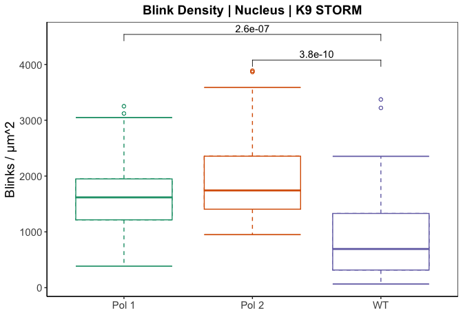
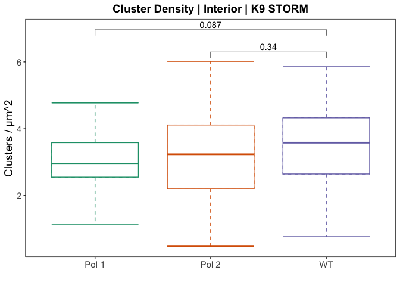
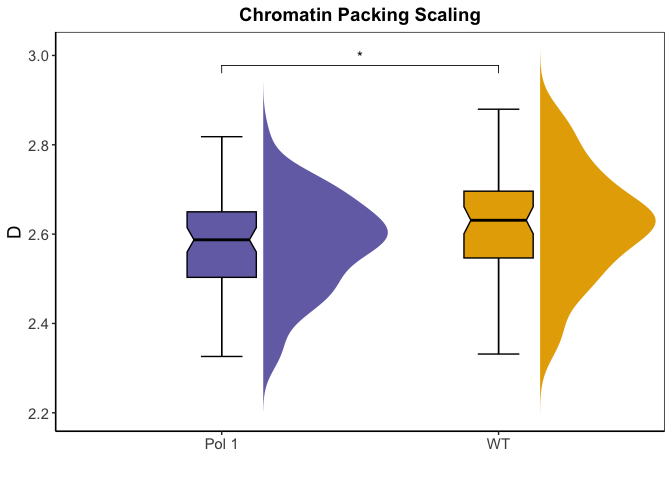

Figure Plots
================
Lucas Carter
2024-10-09

## Figure Panels

This file contains the code necessary for generating the image data
figures in each panel of **“Extra-nucleolar Pol I regulates gene
transcription through chromatin domain maintenance”**. RNAseq, Cut&Tag,
and Hi-C analysis code used to generate plots in figure panels 3,4,6,and
7 are in separate markdowns.

#### Load initial packages here

Loads initial packages and set root directory where dryad repository is
stored

``` r
rm(list = ls())

## Set your root directory here
root<- "/Volumes/external hd/IBiS/Backman_Lab/Transcription Publication/repositories/dryad/"

# import packages
require("ggplot2")
require("dplyr")
require("tidyr")
require("magrittr")
require("plyranges")
require("GenomicRanges")
require("forcats")
require("ggforce")
require("PupillometryR")
require("plyr")
require("stats")
require("RColorBrewer")
```

#### Load functions

``` r
## Reorganize data
col_Data <- function(label, file, dir) {
  
  require(dplyr)  
  
  data <- read.table(file.path(root,dir, file), sep= ",", header= T)
  
  rownames(data) <- data$X
  data <- data[,-c(1)]
  x <- t(as.matrix(data))
  x <- data.frame(x) %>% mutate(analysis = rep(label, nrow(x)), n = seq(1,nrow(x)))
  
  return(x)
}

## Plot boxplots with p-values
plot_Box <- function(data, label, ylab,col.y, col.x, scale) {
  
  require(ggpubr)
  require(ggplot2)
  
  my_comparisons <- list( c("pol2", "wt"), c("pol1", "wt") )
  colors <- c("#39b185","#eeb479","#cf597e")
  
  p <- ggplot(data, aes_string(x={{col.x}}, y = {{col.y}},  color={{col.x}})) +
    geom_boxplot(linetype = "dashed", size=0.5, outlier.shape = 1) +
    stat_boxplot(aes(ymin = ..lower.., ymax = ..upper..), outlier.shape = 1) +
    stat_boxplot(geom = "errorbar", aes(ymin = ..ymax..)) +
    stat_boxplot(geom = "errorbar", aes(ymax = ..ymin..)) + scale +
    ggtitle(paste0(label)) + xlab("") + ylab(ylab)+ scale_x_discrete(labels = c("Pol 1", "Pol 2", "WT"))+
    theme_classic() + theme(legend.position="",plot.title = element_text(hjust = 0.5, size = 14, face = "bold"),text = element_text(size=14, family="Arial"), axis.text.x = element_text(angle = 0), panel.border = element_rect(linetype = "solid", colour = "black", fill = "NA", size = 0.5)) + stat_compare_means(label = "p.format", comparisons = my_comparisons, method = "t.test",ref.group = ".all.") 
  
  print(p)
  
}

## Plot chromSTEM data as violin
plot_violin <- function(data, title, xlab, ylab, y.pos,col.y, col.x, cols, comps) {
  
  require(ggpubr)
  require(ggplot2)
  
  my_comparisons <- comps
  
  p <- ggplot(data, aes_string(x={{col.x}}, y = {{col.y}},  color={{col.x}}, fill={{col.x}})) +
    geom_flat_violin(color = NA,trim = F, position = position_nudge(x = .15))+ 
    stat_boxplot(geom = "errorbar", width = 0.15, aes(color = "black")) +
    geom_boxplot(width = 0.25,notch=TRUE, notchwidth = 0.8, outlier.shape = NA)+ scale_color_manual(values=rep("black", length(unique(data$cond))+1))+ scale_fill_manual(values = cols) +
    ggtitle(paste0(title)) + xlab("") + ylab(ylab)+ scale_x_discrete(labels = xlab)+
    theme_classic() + theme(legend.position="",plot.title = element_text(hjust = 0.5, size = 14, face = "bold"),text = element_text(size=14, family="Arial"), axis.text.x = element_text(angle = 0),
                            panel.border = element_rect(linetype = "solid", colour = "black", fill = "NA", size = 0.5)) + 
    stat_compare_means(#label = "p.format",
      label = "p.signif",
      comparisons = my_comparisons, 
      #method = "t.test", 
      ref.group = ".all.", ## for multiple comparisons
      label.y = y.pos
    ) 
  
  print(p)
  
}
```

#### Figure 1A-C:

These are plots of PWS data in which HCT116 cells were treated with 5
µg/mL of Act D for 1 hour: A) Chromatin packing scaling (nucleus
average) B) Chromatin diffusion C) Fractional moving mass. Refer to
[Label-free imaging of the native, living cellular nanoarchitecture
using partial-wave spectroscopic
microscopy](https://www.pnas.org/doi/10.1073/pnas.1608198113) for
details on PWS.

    ## character(0)

    ## 
    ##  Welch Two Sample t-test
    ## 
    ## data:  x$D and y$D
    ## t = -4.6107, df = 909.83, p-value = 4.588e-06
    ## alternative hypothesis: true difference in means is not equal to 0
    ## 95 percent confidence interval:
    ##  -0.04117375 -0.01658724
    ## sample estimates:
    ## mean of x mean of y 
    ##  2.648071  2.676952

    ## 
    ##  Welch Two Sample t-test
    ## 
    ## data:  x$Diffusion and y$Diffusion
    ## t = 9.5193, df = 938.17, p-value < 2.2e-16
    ## alternative hypothesis: true difference in means is not equal to 0
    ## 95 percent confidence interval:
    ##  0.0001757152 0.0002669818
    ## sample estimates:
    ##   mean of x   mean of y 
    ## 0.002022778 0.001801429

    ## 
    ##  Welch Two Sample t-test
    ## 
    ## data:  x$FMM and y$FMM
    ## t = -27.273, df = 920.76, p-value < 2.2e-16
    ## alternative hypothesis: true difference in means is not equal to 0
    ## 95 percent confidence interval:
    ##  -1.226698e-19 -1.062005e-19
    ## sample estimates:
    ##    mean of x    mean of y 
    ## 1.495242e-19 2.639593e-19

<!-- --><!-- --><!-- -->

#### Figure 1D-F:

These are plots of chromatin electron microscopy data in which HCT116
cells were treated with 5 µg/mL of Act D for 1 hour prior to fixation
and imaging: D) Chromatin packing scaling (domains) E) Chromatin domain
radius F) Chromatin volume concentration for domains. Refer to [Analysis
of three-dimensional chromatin packing domains by chromatin scanning
transmission electron microscopy
(ChromSTEM)](https://www.nature.com/articles/s41598-022-16028-2) for
details on chromSTEM.

    ## character(0)

    ## 
    ##  Welch Two Sample t-test
    ## 
    ## data:  x$D and y$D
    ## t = 1.2984, df = 91.186, p-value = 0.1974
    ## alternative hypothesis: true difference in means is not equal to 0
    ## 95 percent confidence interval:
    ##  -0.01509571  0.07208586
    ## sample estimates:
    ## mean of x mean of y 
    ##  2.731440  2.702945

    ## 
    ##  Welch Two Sample t-test
    ## 
    ## data:  x$Rf and y$Rf
    ## t = 3.1641, df = 89.779, p-value = 0.002124
    ## alternative hypothesis: true difference in means is not equal to 0
    ## 95 percent confidence interval:
    ##   9.733849 42.584226
    ## sample estimates:
    ## mean of x mean of y 
    ##  129.7083  103.5493

    ## 
    ##  Welch Two Sample t-test
    ## 
    ## data:  x$CVC and y$CVC
    ## t = 3.1188, df = 90.645, p-value = 0.002434
    ## alternative hypothesis: true difference in means is not equal to 0
    ## 95 percent confidence interval:
    ##  0.02324494 0.10480117
    ## sample estimates:
    ## mean of x mean of y 
    ## 0.6113040 0.5472809

<!-- --><!-- --><!-- -->

#### Figure 1J-K,L:

These are plots of single molecule localization microscopy data in which
HCT116 cells were treated with 5 µg/mL of Act D for 1 hour and stained
for POLR2A-PS5 and H3K9me3: J) Kernel density estimate of H3K9me3 E)
Kernal density estimate of POLR2A-PS5 L) Association profile of Pol-II
molecules with heterochromatin (H3K9me3) clusters. Refer to [Nanoscale
chromatin imaging and analysis platform bridges 4D chromatin
organization with molecular
function](https://pubmed.ncbi.nlm.nih.gov/33523864/) for information on
how SMLM is used in this context.

<!-- --><!-- --><!-- -->

#### Figure 2B:

This is a plot of CTCF values for EU-labelled nascent RNA following
degradation of POLR1A, POLR2A, or treatment with 5 µg/mL of Act D for 1
hour or 6 hours.

    ## character(0)

    ## 
    ##  Welch Two Sample t-test
    ## 
    ## data:  as.numeric(x$CTCF) and as.numeric(y$CTCF)
    ## t = -11.077, df = 42.16, p-value = 4.618e-14
    ## alternative hypothesis: true difference in means is not equal to 0
    ## 95 percent confidence interval:
    ##  -10980.540  -7596.329
    ## sample estimates:
    ## mean of x mean of y 
    ##  4657.785 13946.220

    ## [1] "Pol1_6hrs_Aux_R1" "Pol2_6hrs_Aux_R1" "wt_1hractd"       "wt_6hractd"      
    ## [5] "all_dmso"

<!-- -->

#### Figure 2F-H:

These are plots of single molecule localization microscopy data for
EU-labelled nascent RNA following degradation of POLR1A or POLR2A: F)
Blink density of reconstructed SMLM images for each condition G) Cluster
density of RNA for each condition, quantified using DBscan F) size of
RNA clusters, quantified using DBscan.

    ## character(0)

<!-- --><!-- --><!-- -->

#### Figure 5D-F:

These are plots of single molecule localization microscopy data for
H3K9me3-labelled DNA following degradation of POLR1A or POLR2A: F) Blink
density of reconstructed SMLM images for each condition G) Cluster
density of RNA for each condition, quantified using DBscan F) size of
RNA clusters, quantified using DBscan.

    ## character(0)

<!-- --><!-- --><!-- --><!-- --><!-- --><!-- --><!-- --><!-- --><!-- -->

#### Figure 5I:

HCT116 POLR1A-AID1 cells were treated with auxin for 6 hours prior to
fixation and imaging using chromSTEM. DBscan was used to find domain
centers. Statistics for each domain were generated. This plots packing
efficiency versus domain size for domains identified with DBscan.

    ## character(0)

<!-- -->

#### Figure 5J-L:

HCT116 POLR1A-AID1 cells were treated with auxin for 6 hours prior to
fixation and imaging using chromSTEM. DBscan was used to find domain
centers. Statistics for each domain were generated. This code generates
violin plots for J) Chromatin packing scaling (domains) K) Chromatin
domain radius L) Chromatin volume concentration for domains. Refer to
[Analysis of three-dimensional chromatin packing domains by chromatin
scanning transmission electron microscopy
(ChromSTEM)](https://www.nature.com/articles/s41598-022-16028-2) for
details on chromSTEM.

    ## character(0)

    ## [1] "#1B9E77" "#D95F02" "#7570B3" "#E7298A" "#66A61E" "#E6AB02"

<!-- --><!-- --><!-- --><!-- --><!-- --><!-- -->

#### Figure 6C:

HCT116 cells were labelled for POLR1A and H3K9me3 and imaged using SMLM.
Association of Pol-I with H3K9me3 clusters is plotted here for N=5
cells. Refer to [Nanoscale chromatin imaging and analysis platform
bridges 4D chromatin organization with molecular
function](https://pubmed.ncbi.nlm.nih.gov/33523864/) for information on
how SMLM is used in this context.

<!-- --><!-- --><!-- -->

    ## R version 4.3.3 (2024-02-29)
    ## Platform: x86_64-apple-darwin20 (64-bit)
    ## Running under: macOS Sonoma 14.2.1
    ## 
    ## Matrix products: default
    ## BLAS:   /Library/Frameworks/R.framework/Versions/4.3-x86_64/Resources/lib/libRblas.0.dylib 
    ## LAPACK: /Library/Frameworks/R.framework/Versions/4.3-x86_64/Resources/lib/libRlapack.dylib;  LAPACK version 3.11.0
    ## 
    ## locale:
    ## [1] en_US.UTF-8/en_US.UTF-8/en_US.UTF-8/C/en_US.UTF-8/en_US.UTF-8
    ## 
    ## time zone: America/Los_Angeles
    ## tzcode source: internal
    ## 
    ## attached base packages:
    ## [1] stats4    stats     graphics  grDevices utils     datasets  methods  
    ## [8] base     
    ## 
    ## other attached packages:
    ##  [1] ggpubr_0.6.0         RColorBrewer_1.1-3   plyr_1.8.9          
    ##  [4] PupillometryR_0.0.5  rlang_1.1.4          ggforce_0.4.2       
    ##  [7] forcats_1.0.0        plyranges_1.22.0     GenomicRanges_1.54.1
    ## [10] GenomeInfoDb_1.38.8  IRanges_2.36.0       S4Vectors_0.40.2    
    ## [13] BiocGenerics_0.48.1  magrittr_2.0.3       tidyr_1.3.1         
    ## [16] dplyr_1.1.4          ggplot2_3.5.1       
    ## 
    ## loaded via a namespace (and not attached):
    ##  [1] tidyselect_1.2.1            farver_2.1.2               
    ##  [3] Biostrings_2.70.3           bitops_1.0-7               
    ##  [5] fastmap_1.2.0               RCurl_1.98-1.14            
    ##  [7] tweenr_2.0.3                GenomicAlignments_1.38.2   
    ##  [9] XML_3.99-0.16.1             digest_0.6.35              
    ## [11] lifecycle_1.0.4             compiler_4.3.3             
    ## [13] tools_4.3.3                 utf8_1.2.4                 
    ## [15] yaml_2.3.8                  rtracklayer_1.62.0         
    ## [17] knitr_1.47                  ggsignif_0.6.4             
    ## [19] S4Arrays_1.2.1              labeling_0.4.3             
    ## [21] DelayedArray_0.28.0         abind_1.4-5                
    ## [23] BiocParallel_1.36.0         withr_3.0.0                
    ## [25] purrr_1.0.2                 grid_4.3.3                 
    ## [27] polyclip_1.10-6             fansi_1.0.6                
    ## [29] colorspace_2.1-0            scales_1.3.0               
    ## [31] MASS_7.3-60.0.1             SummarizedExperiment_1.32.0
    ## [33] cli_3.6.2                   rmarkdown_2.27             
    ## [35] crayon_1.5.2                generics_0.1.3             
    ## [37] rstudioapi_0.16.0           rjson_0.2.21               
    ## [39] stringr_1.5.1               zlibbioc_1.48.2            
    ## [41] parallel_4.3.3              XVector_0.42.0             
    ## [43] restfulr_0.0.15             matrixStats_1.3.0          
    ## [45] vctrs_0.6.5                 Matrix_1.6-5               
    ## [47] carData_3.0-5               car_3.1-2                  
    ## [49] rstatix_0.7.2               glue_1.7.0                 
    ## [51] codetools_0.2-20            stringi_1.8.4              
    ## [53] gtable_0.3.5                BiocIO_1.12.0              
    ## [55] munsell_0.5.1               tibble_3.2.1               
    ## [57] pillar_1.9.0                htmltools_0.5.8.1          
    ## [59] GenomeInfoDbData_1.2.11     R6_2.5.1                   
    ## [61] evaluate_0.24.0             lattice_0.22-6             
    ## [63] Biobase_2.62.0              highr_0.11                 
    ## [65] backports_1.5.0             Rsamtools_2.18.0           
    ## [67] broom_1.0.6                 Rcpp_1.0.12                
    ## [69] SparseArray_1.2.4           xfun_0.45                  
    ## [71] MatrixGenerics_1.14.0       pkgconfig_2.0.3
