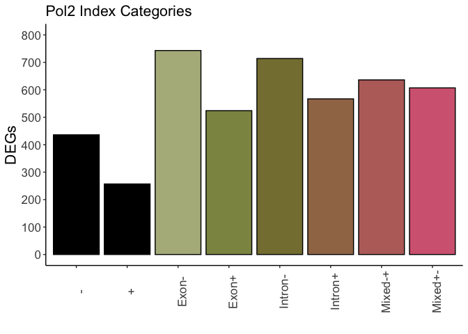

Intron Analysis
================
Lucas Carter
2024-10-10

## Intron Analysis Figure Panel 7

This file contains the code necessary for generating the figures in
Figure Panel 7 that use intron coverage data from total RNAseq generated
for **“Extra-nucleolar Pol I regulates gene transcription through
chromatin domain maintenance”**. Intron annotations were derived using
the [scripts here](https://github.com/charitylaw/Intron-reads). DE
introns were quantified using the [intron differences to
exon](https://github.com/Shians/index) or INDEX package.

#### Load initial packages here

Loads initial packages and set root directory where dryad repository is
stored

``` r
rm(list = ls())
gc()
```

    ##          used (Mb) gc trigger (Mb) limit (Mb) max used (Mb)
    ## Ncells 479254 25.6    1034534 55.3         NA   669525 35.8
    ## Vcells 901104  6.9    8388608 64.0     153600  1852051 14.2

``` r
## Set your root directory here
root<- "/Volumes/external hd/IBiS/Backman_Lab/Transcription Publication/repositories/dryad/"

# import packages
require("ggplot2")
require("index")
require("dplyr")
require("forcats")
require("stringr")
require("matrixStats")
require("pheatmap")
require("viridis")
require("dendsort")
require("tidyr")
require("ggpubr")
require("ggside")
require("data.table")
```

#### Load main functions

**does not include functions adapted from INDEX for plotting**

``` r
#########################################################################################
# Main Functions
#########################################################################################

getOverlaps <- function(root, exps, dir.loop, loop.file, dir.int, interval, cond, diff.loop,anchors, degs){
  
  ## exps: vector of experiment labels # exps <- c("WT_HCT116_CTRL","Pol1_6hrs_Aux","Pol2_6hrs_Aux")
  ## dir.loop: root directory of loops # dir.loop <- "/Users/lucascarter/Documents/IBiS/Backman_Lab/projects/My_Projects/112123_HiC/112123_HiC/loop_analysis/"
  ## dir.int: root director of genomic ranges intervals # dir.int <- "/Users/lucascarter/Documents/IBiS/Backman_Lab/projects/My_Projects/101823_RNAseq/Annotations/Intron_GTFs"
  ## cond: a string for the condition name
  ## anchors: boolean for if using 5' and 3' loop anchors instead of full loop
  ## degs: boolean if using DEG list. values set to 0.05 and 0.58
  ## Loop file must be in HICCUPS format
  
  require(plyranges)
  require(dplyr)
  
  ##-------------------------------------------------------## Loop BED file
  
  if (diff.loop == T){
    
    loops <- as.data.frame(read.table(file.path(root, dir.loop,loop.file), sep= "\t", header= F))
    
    if ( anchors == T ){
      
      loops.5p <- loops %>% transform( seqnames= paste0("chr",V1), start = V2, end = V3)  %>% as_granges()
      loops.3p <- loops  %>% transform( seqnames= paste0("chr",V1), start = V5, end = V6)  %>% as_granges()
      
      ints <- as.data.frame(read.table(file.path(dir.int,interval), sep= "\t", header= T))
      ints <- ints %>% filter(abs(logFC) > 0.58, ints$adj.P.Val < 0.05)
      ints <- ints  %>% transform( seqnames= paste0(Chr), start = Start , end = End)  %>% as_granges()
      
      int.overlaps.3p <- data.frame(join_overlap_inner(loops.3p, ints))
      int.overlaps.5p <- data.frame(join_overlap_inner(loops.5p, ints))
      
      int.out <- rbind(int.overlaps.3p, int.overlaps.5p)
      int.out <- int.out  %>% dplyr::mutate(dups = paste0(V1, "_", V22, "_",V23)) %>% dplyr::distinct(dups, .keep_all = T) ## Filter dups
      int.out$cond <- rep(cond, nrow(int.out))
      
      return(int.out)
      ##-------------------------------------------------------## loop DEG overlaps
    } else if ( degs == T ) {
      
      loops <- loops %>% transform( seqnames= paste0("chr",V1), start = V22, end = V23) %>% as_granges()
      
      ints <- as.data.frame(read.table(file.path(dir.int,interval), sep= "\t", header= T))
      ints <- ints %>% filter(abs(logFC) > 0.58, ints$adj.P.Val < 0.05) ## filter ints for DE
      #ints <- ints %>% filter(logFC < 0.58, ints$adj.P.Val < 0.05) ## filter ints for downregulated DE
      #ints <- ints %>% filter(logFC > 0.58, ints$adj.P.Val < 0.05) ## filter ints for upregulated DE
      
      ints <- ints  %>% transform( seqnames= paste0(Chr), start = Start , end = End)  %>% as_granges()
      
      int.out <- data.frame(join_overlap_inner(loops, ints))
      int.out <- int.out  %>% dplyr::mutate(dups = paste0(V1, "_", V22, "_",V23)) %>% dplyr::distinct(dups, .keep_all = T) ## Filter dups
      int.out$cond <- rep(cond, nrow(int.out))
      
      return(int.out)
      ##-------------------------------------------------------## loop interval overlaps
    } else {
      
      loops <- loops %>% transform( seqnames= paste0("chr",V1), start = V22, end = V23)  %>% as_granges()
      
      ints <- as.data.frame(read.table(file.path(roo, dir.int,interval), sep= "\t", header= T))
      ints <- ints  %>% transform( seqnames= paste0(Chr), start = Start , end = End)  %>% as_granges()
      
      int.out <- data.frame(join_overlap_inner(loops, ints))
      int.out <- int.out  %>% dplyr::mutate(dups = paste0(V1, "_", V22, "_",V23)) %>% dplyr::distinct(dups, .keep_all = T) ## Filter dups
      int.out$cond <- rep(cond, nrow(int.out))
      
      return(int.out)
      
    }
    
  } else {
    
    loops <- as.data.frame(read.table(file.path(root, dir.loop,exps,loop.file), sep= "\t", header= F))
    ##-------------------------------------------------------## Loop anchors overlap
    if ( anchors == T ){
      
      loops.5p <- loops %>% transform( seqnames= paste0("chr",V1), start = V2, end = V3)  %>% as_granges()
      loops.3p <- loops  %>% transform( seqnames= paste0("chr",V1), start = V5, end = V6)  %>% as_granges()
      
      ints <- as.data.frame(read.table(file.path(root, dir.int,interval), sep= "\t", header= T))
      #ints <- ints %>% filter(abs(logFC) > 0.58, ints$adj.P.Val < 0.05)
      ints <- ints  %>% transform( seqnames= paste0(Chr), start = Start , end = End)  %>% as_granges()
      
      int.overlaps.3p <- data.frame(join_overlap_inner(loops.3p, ints))
      int.overlaps.5p <- data.frame(join_overlap_inner(loops.5p, ints))
      
      int.out <- rbind(int.overlaps.3p, int.overlaps.5p)
      int.out <- int.out  %>% dplyr::mutate(dups = paste0(V1, "_", V22, "_",V23)) %>% dplyr::distinct(dups, .keep_all = T) ## Filter dups
      int.out$cond <- rep(cond, nrow(int.out))
      
      return(int.out)
      ##-------------------------------------------------------## loop DEG overlaps
    } else if ( degs == T ) {
      
      loops <- loops %>% transform( seqnames= paste0("chr",V1), start = V22, end = V23) %>% as_granges()
      
      ints <- as.data.frame(read.table(file.path(dir.int,interval), sep= "\t", header= T))
      ints <- ints %>% filter(abs(logFC) > 0.58, ints$adj.P.Val < 0.05) ## filter ints for DE
      #ints <- ints %>% filter(logFC < 0.58, ints$adj.P.Val < 0.05) ## filter ints for downregulated DE
      #ints <- ints %>% filter(logFC > 0.58, ints$adj.P.Val < 0.05) ## filter ints for upregulated DE
      
      ints <- ints  %>% transform( seqnames= paste0(Chr), start = Start , end = End)  %>% as_granges()
      
      int.out <- data.frame(join_overlap_inner(loops, ints))
      int.out <- int.out  %>% dplyr::mutate(dups = paste0(V1, "_", V22, "_",V23)) %>% dplyr::distinct(dups, .keep_all = T) ## Filter dups
      int.out$cond <- rep(cond, nrow(int.out))
      
      return(int.out)
      ##-------------------------------------------------------## loop interval overlaps
    } else {
      
      loops <- loops %>% transform( seqnames= paste0("chr",V1), start = V22, end = V23)  %>% as_granges()
      
      ints <- as.data.frame(read.table(file.path(dir.int,interval), sep= "\t", header= T))
      ints <- ints  %>% transform( seqnames= paste0(Chr), start = Start , end = End)  %>% as_granges()
      
      int.out <- data.frame(join_overlap_inner(loops, ints))
      int.out <- int.out  %>% dplyr::mutate(dups = paste0(V1, "_", V22, "_",V23)) %>% dplyr::distinct(dups, .keep_all = T) ## Filter dups
      int.out$cond <- rep(cond, nrow(int.out))
      
      return(int.out)
      
    }
    
  }
  
}

## Function to tile loop data
Tile <- function(x, quantile){
  
  require(dplyr)
  
  bin <- seq(0,quantile,1)
  
  x$dist <- abs(x$V2 - x$V6)
  x <- x %>% mutate(bin = ntile(log10(dist), as.numeric(quantile)))
  n <- x %>% group_by(bin) %>% reframe(mean.obs = round(mean(log10(dist)), 3))
  x$binN <- cut(x$bin, breaks = bin,labels = n$mean.obs)
  
  x <- x %>% group_by(binN, cond)%>% reframe(obs = mean(log10(V12)))
  
  return(x)
  
}

## Function to sum DE introns within loop anchors
sumDEints <- function(x, quantile){
  
  require(dplyr)
  
  bin <- seq(0,quantile,1)
  
  x$dist <- abs(x$V2 - x$V6)
  x <- x %>% mutate(bin = ntile(log10(dist), as.numeric(quantile)))
  n <- x %>% group_by(bin) %>% reframe(mean.obs = round(mean(log10(dist)), 3))
  x$binN <- cut(x$bin, breaks = bin,labels = n$mean.obs)
  
  x <- x %>% group_by(binN, cond)%>% reframe(DEsum = length(unique(GeneID)))
  
  return(x)
  
}

## Function to get overlaps with MultiHiCcompare results ## redundant code - simplify later
getMultiOverlaps <- function(multi.file, dir.int, interval, conds, degs){
  
  require(plyranges)
  require(dplyr)
  
  ##-------------------------------------------------------## Loop BED file
  multi.df <- multi.file[multi.file$cond == conds,]
  cat(paste0("processing ", conds," for DF: ", "\n"))
  print(head(multi.df ))
  cat(paste0(nrow(multi.df),"\n"))
  
  if ( degs == T ) {
    
    multi.df <- multi.df %>% transform( seqnames= paste0("chr",chr), start = start, end = stop) %>% as_granges()
    
    ints <- as.data.frame(read.table(file.path(root,dir.int,interval), sep= "\t", header= T))
    ints <- ints %>% filter(abs(logFC) > 0.58, ints$adj.P.Val < 0.05) ## filter ints for DE
    #ints <- ints %>% filter(logFC < 0.58, ints$adj.P.Val < 0.05) ## filter ints for downregulated DE
    #ints <- ints %>% filter(logFC > 0.58, ints$adj.P.Val < 0.05) ## filter ints for upregulated DE
    
    ints <- ints  %>% transform( seqnames= paste0(Chr), start = Start , end = End)  %>% as_granges()
    
    int.out <- data.frame(join_overlap_inner(multi.df, ints))
    int.out <- int.out  %>% dplyr::mutate(dups = paste0(seqnames, "_", start, "_",end)) %>% dplyr::distinct(dups, .keep_all = T) ## Filter dups
    int.out$cond <- rep(conds, nrow(int.out))
    
    return(int.out)
    ##-------------------------------------------------------## loop interval overlaps
  } else {
    
    multi.df <- multi.df %>% transform( seqnames= paste0("chr",chr), start = start, end = stop) %>% as_granges()
    
    ints <- as.data.frame(read.table(file.path(root,dir.int,interval), sep= "\t", header= T))
    ints <- ints  %>% transform( seqnames= paste0(Chr), start = Start , end = End)  %>% as_granges()
    
    int.out <- data.frame(join_overlap_inner(multi.df, ints))
    int.out <- int.out  %>% dplyr::mutate(dups = paste0(seqnames, "_", start, "_",end)) %>% dplyr::distinct(dups, .keep_all = T) ## Filter dups
    int.out$cond <- rep(conds, nrow(int.out))
    
    return(int.out)
    
  }
  
} 

## Another somewhat redundant tiling funciton for multiHiCcompare overlaps
tileDist <- function(x, quantile, summarize){
  
  require(dplyr)
  
  bin <- seq(0,quantile,1)
  x <- x %>% mutate(bin = ntile(D, as.numeric(quantile)))
  #x <- x %>% mutate(bin = ntile(logFC, as.numeric(quantile)))
  
  if (summarize == T){
    
    x$count = rep(1, nrow(x))
    n <- x %>% group_by(bin) %>% reframe(mean.dis = round(mean(D, 3)))
    #n <- x %>% group_by(bin) %>% reframe(mean.dis = round(mean(logFC, 3)))
    x$binN <- cut(x$bin, breaks = bin,labels = n$mean.dis)
    
    x <- x %>% distinct(GeneID, .keep_all = T)
    x <- x %>% group_by(binN,cond) %>% distinct(GeneID, .keep_all = T) %>% summarise( sum = sum(count)) %>% ungroup() 
    x <- x %>% mutate(factor = seq(1,nrow(x),1))
    
    
  } else {
    
    n <- x %>% group_by(bin) %>% reframe(mean.dis = round(mean(D, 3)))
    x$binN <- cut(x$bin, breaks = bin,labels = n$mean.dis)
    
    x <- x %>% distinct(GeneID, .keep_all = T)
  }
  
  
  return(x)
  
}

## Volcano plot function
DE_Vol_Plot <- function(results, plt.title, lfc.up=0.58, lfc.dwn=-0.58,pvadj=0.05,
                        y.limits, x.limits=c(-10,10),dncol="#D46780", upcol="#798234") {
  require(ggrepel)
  require(ggplot2)
  require(dplyr)
  
  ## Generate data frame
  genes.rna <- data.frame(symbol = results$GeneID,lfc = results$logFC, padj=results$adj.P.Val, base=results$AveExpr)
  
  resultsDN <- as.data.frame(genes.rna[which(genes.rna$lfc < lfc.dwn),])
  resultsDN <- as.data.frame(resultsDN[which(resultsDN$padj < pvadj),])
  length(rownames(resultsDN)) ## Gives count of down regulated
  
  resultsUP <- as.data.frame(genes.rna[which(genes.rna$lfc > lfc.up),])
  resultsUP <- as.data.frame(resultsUP[which(resultsUP$padj < pvadj),])
  length(rownames(resultsUP)) ## Gives count of up regulated  
  
  ## add a column of NAs
  genes.rna$diffexpressed <- "NO"
  ## If log2Foldchange > 0.6 and pvalue < 0.05, set as "UP" 
  genes.rna$diffexpressed[genes.rna$lfc > lfc.up & genes.rna$padj < pvadj] <- "Upregulated"
  ## If log2Foldchange < -0.6 and pvalue < 0.05, set as "DOWN"
  genes.rna$diffexpressed[genes.rna$lfc < lfc.dwn & genes.rna$padj < pvadj] <- "Downregulated"
  
  ## Create a new column "delabel" to de, that will contain the name of genes differentially expressed (NA in case they are not)
  genes.rna$delabel <- NA
  genes.rna$delabel[genes.rna$diffexpressed != "NO"] <- genes.rna$symbol[genes.rna$diffexpressed != "NO"]
  
  ## Jitter labeling
  pos <- position_jitter(width = 0.2, seed = 1)
  
  vplot <- genes.rna %>% mutate(mean.intensity = base/max(base)) %>% 
    ggplot(aes(x=lfc, y=-log10(padj), col=diffexpressed, size = mean.intensity #, label=delabel
    )) +
    geom_point(position = pos, alpha=0.7)+ theme_classic()+
    scale_color_manual(name="Upregulated", values=c(dncol, "lightgrey", upcol))+
    geom_vline(xintercept=c(lfc.dwn, lfc.up), col="red", lty = "dashed") +
    geom_hline(yintercept=-log10(pvadj), col="red", lty = "dashed")+ 
    #geom_text_repel(segment.color = 'transparent', position = pos, size = 3, xlim  = c(-6,6)) +
    labs(title=plt.title, subtitle=paste(paste("Downregulated:",length(rownames(resultsDN))), paste("| Upregulated:",length(rownames(resultsUP))))) +
    scale_y_continuous(name="-Log 10 Padj", limits=c(0,y.limits), breaks=seq(0,y.limits, by =50))+
    scale_x_continuous(name="Log 2 Fold Change", limits=x.limits, breaks=c(-7,-6,-5,-4,-3,-2,-1,0,1,2,3,4,5,6,7))+
    theme( legend.position="none",plot.title = element_text(size=16), text = element_text(size=16, family="Arial"), axis.text.x = element_text(angle = 0)) 
  
  return(vplot)
  
}
```

#### Figure 7H-I: Loop anchor overlap with DE introns

Loops called using HICCUPS for each HiC condition were binned by loop
size. Loop anchors were intersected with DE introns and loop strength or
intron-anchor overlap were quantified.

``` r
#########################################################################################
# check differential intron loop overlap 
#########################################################################################

## define repeat variables
dir.deg <-"/RNAseq/results/Intron_counts"
dir.loop <- "/HiC/loop_analysis"

## get overlap between all loops and DE introns
exps <- c("WT_HCT116_CTRL","Pol1_6hrs_Aux","Pol2_6hrs_Aux")

## Pol 1 introns first

wtlps.p1ints <- getOverlaps(root = root, exps = exps[1], dir.loop = dir.loop, loop.file = "merged_loops.bedpe",dir.int=dir.deg, interval="pol1.intron.dge.txt", cond = "WT loops: Pol1 DE introns", diff.loop = F,anchors = T, degs = T)
p1lps.p1ints <- getOverlaps(root = root,exps = exps[2], dir.loop = dir.loop, loop.file = "merged_loops.bedpe",dir.int=dir.deg, interval="pol1.intron.dge.txt", cond = "Pol1 loops: Pol1 DE introns", diff.loop = F,anchors = T, degs = T)
p2lps.p1ints <- getOverlaps(root = root,exps = exps[3], dir.loop = dir.loop, loop.file = "merged_loops.bedpe",dir.int=dir.deg, interval="pol1.intron.dge.txt", cond = "Pol2 loops: Pol1 DE introns", diff.loop = F,anchors = T, degs = T)

## Then Pol 2 introns
wtlps.p2ints <- getOverlaps(root = root,exps = exps[1], dir.loop = dir.loop, loop.file = "merged_loops.bedpe",dir.int=dir.deg, interval="pol2.intron.dge.txt", cond = "WT loops: Pol2 DE introns", diff.loop = F,anchors = T, degs = T)
p1lps.p2ints <- getOverlaps(root = root,exps = exps[2], dir.loop = dir.loop, loop.file = "merged_loops.bedpe",dir.int=dir.deg, interval="pol2.intron.dge.txt", cond = "Pol1 loops: Pol2 DE introns", diff.loop = F,anchors = T, degs = T)
p2lps.p2ints <- getOverlaps(root = root,exps = exps[3], dir.loop = dir.loop, loop.file = "merged_loops.bedpe",dir.int=dir.deg, interval="pol2.intron.dge.txt", cond = "Pol2 loops: Pol2 DE introns", diff.loop = F,anchors = T, degs = T)

## Get NULL populations
ints.wt.all <- getOverlaps(root = root,exps = exps[1], dir.loop = dir.loop, loop.file = "merged_loops.bedpe",dir.int=dir.deg, interval="intron.txt", cond = "WT loops: all introns",diff.loop = F,anchors = T, degs = F)
ints.p1.all <- getOverlaps(root = root,exps = exps[2], dir.loop = dir.loop, loop.file = "merged_loops.bedpe",dir.int=dir.deg, interval="intron.txt", cond = "Pol1 loops: all introns", diff.loop = F,anchors = T, degs = F)
ints.p2.all <- getOverlaps(root = root,exps = exps[3], dir.loop = dir.loop, loop.file = "merged_loops.bedpe",dir.int=dir.deg, interval="intron.txt", cond = "Pol2 loops: all introns", diff.loop = F,anchors = T, degs = F)

##-------------------------------------------------------## Tile data and plot dist vs obs

## Group data
null.df <- rbind(ints.p2.all, ints.wt.all, ints.p1.all)
group.df <- rbind(wtlps.p1ints, p1lps.p1ints, wtlps.p2ints, p2lps.p2ints)

## Bin
group.obs <- Tile(group.df , 8)
null.obs <- Tile(null.df, 8)

gatherObs <- function(df, group){
  
  require(pheatmap) 
  colors <- colorRampPalette(c("#798234","white","#D46780"))(64)
  
  ## get conditon labels
  dput(unique(df$cond))
  cond <- dput(unique(df$cond))
  
  ## reshape data
  df.dist <- data.frame(bin = unique(group$binN))
  cols <- c()
  for (c in 1:length(cond)) {
    
    ## Bring in conditions
    c <- cond[c]
    x <- group[group$cond == c,]
    
    cat(paste0(" adding condition : ", c, "\n"))
    
    cols <- rbind(cols,c) ## Collect colnames
    df.dist <- cbind(df.dist, obs = as.numeric(x$obs))
    colnames(df.dist) <- c("bin",cols) ## Add colnames
  }
  
  ## Prepapre for plotting
  rownames <- unique(group$binN)
  df.dist <- df.dist[,-c(1)]
  
  ## Get heatmap of distance data ## decile.heatmap.allcounts ## decile.heatmap.pol1.lfc.up ## decile.heatmap.pol1.lfc.dn ## decile.heatmap.actd.lfc.dn ## decile.heatmap.actd.lfc.up
  p <- pheatmap(df.dist, display_numbers = F, number_color = "black", color = colors,
                labels_row = rownames, cellwidth = 25, cellheight = 25,
                fontsize_number = 8,  cluster_rows = FALSE,  cluster_cols = T, 
                main = "")
  
  print(p)
  
}

## get intron sums over loops
gatherObs(null.df, null.obs)
```

    ## c("Pol2 loops: all introns", "WT loops: all introns", "Pol1 loops: all introns"
    ## )
    ## c("Pol2 loops: all introns", "WT loops: all introns", "Pol1 loops: all introns"
    ## )
    ##  adding condition : Pol2 loops: all introns
    ##  adding condition : WT loops: all introns
    ##  adding condition : Pol1 loops: all introns

<!-- -->

``` r
gatherObs(group.df, group.obs)
```

    ## c("WT loops: Pol1 DE introns", "Pol1 loops: Pol1 DE introns", 
    ## "WT loops: Pol2 DE introns", "Pol2 loops: Pol2 DE introns")
    ## c("WT loops: Pol1 DE introns", "Pol1 loops: Pol1 DE introns", 
    ## "WT loops: Pol2 DE introns", "Pol2 loops: Pol2 DE introns")
    ##  adding condition : WT loops: Pol1 DE introns
    ##  adding condition : Pol1 loops: Pol1 DE introns
    ##  adding condition : WT loops: Pol2 DE introns
    ##  adding condition : Pol2 loops: Pol2 DE introns

<!-- -->

``` r
##-------------------------------------------------------## Decile plots of distance vs coverage

## Group data
null.df <- rbind(ints.p2.all, ints.wt.all, ints.p1.all)
group.df <- rbind(wtlps.p1ints, p1lps.p1ints, wtlps.p2ints, p2lps.p2ints)

## Bin
group.sum <- sumDEints(group.df , 8)
null.sum <- sumDEints(null.df, 8)

gatherSums <- function(df, group){
  
require(pheatmap)
colors <- colorRampPalette(c("#798234","white","#D46780"))(64)

## get conditon labels
dput(unique(df$cond))
cond <- dput(unique(df$cond))

## reshape data
df.dist <- data.frame(bin = unique(group$binN))
cols <- c()
for (c in 1:length(cond)) {
  
  ## Bring in conditions
  c <- cond[c]
  x <- group[group$cond == c,]
  
  cat(paste0(" adding condition : ", c, "\n"))
  
  cols <- rbind(cols,c) ## Collect colnames
  df.dist <- cbind(df.dist, sum = as.numeric(x$DEsum))
  colnames(df.dist) <- c("bin",cols) ## Add colnames
}

## Prepapre for plotting
rownames <- unique(group$binN)
df.dist <- df.dist[,-c(1)]

## Get heatmap of distance data ## decile.heatmap.allcounts ## decile.heatmap.pol1.lfc.up ## decile.heatmap.pol1.lfc.dn ## decile.heatmap.actd.lfc.dn ## decile.heatmap.actd.lfc.up
p <- pheatmap(df.dist, display_numbers = F, number_color = "black", color = colors,
         labels_row = rownames, cellwidth = 25, cellheight = 25,
         fontsize_number = 8,  cluster_rows = FALSE,  cluster_cols = T, 
         main = "")

print(p)

}

## get intron sums over loops
gatherSums(null.df, null.sum)
```

    ## c("Pol2 loops: all introns", "WT loops: all introns", "Pol1 loops: all introns"
    ## )
    ## c("Pol2 loops: all introns", "WT loops: all introns", "Pol1 loops: all introns"
    ## )
    ##  adding condition : Pol2 loops: all introns
    ##  adding condition : WT loops: all introns
    ##  adding condition : Pol1 loops: all introns

<!-- -->

``` r
gatherSums(group.df, group.sum)
```

    ## c("WT loops: Pol1 DE introns", "Pol1 loops: Pol1 DE introns", 
    ## "WT loops: Pol2 DE introns", "Pol2 loops: Pol2 DE introns")
    ## c("WT loops: Pol1 DE introns", "Pol1 loops: Pol1 DE introns", 
    ## "WT loops: Pol2 DE introns", "Pol2 loops: Pol2 DE introns")
    ##  adding condition : WT loops: Pol1 DE introns
    ##  adding condition : Pol1 loops: Pol1 DE introns
    ##  adding condition : WT loops: Pol2 DE introns
    ##  adding condition : Pol2 loops: Pol2 DE introns

<!-- -->

#### Figure 7J: DI interaction overlap with DE introns

Differential interactions generated using
[MultiHiCcompare](https://github.com/dozmorovlab/multiHiCcompare) for
each HiC condition were binned by DI size. DIs were intersected with DE
introns and overlap was quantified.

``` r
#####################################################################################
#  MultiHiCompare                     
#####################################################################################

## super fast for loop to get all files and compile them into a single data frame
conds <- c("Pol1", "Pol2")
dir <- '/HiC/MultiHiCcompare/5000bpRes/'

df.f <- data.frame()
for (c in 1:length(conds)) {
  
  cond <- conds[c]
  cat(paste0("processing ", cond, "\n"))
  
  myFiles <- list.files(file.path(root,dir),pattern=paste0(cond,"_"))
  myList <- lapply(file.path(root,dir,myFiles), function(x) fread(x))
  df <- do.call("rbind",myList) 
  df$cond <- rep(cond,nrow(df))
  
  df.f <- rbind(df.f, df)
  
  
}
```

    ## processing Pol1
    ## processing Pol2

``` r
colnames(df.f) <- c("chr", "start", "stop", "D", "logFC", "logCPM", "p.value", "p.adj", "cond")

## define repeat variables
dir.deg <-"/RNAseq/results/Intron_counts"
dir.loop <- "/HiC/loop_analysis"

## Pol int coverage
p1de.p1ints <- getMultiOverlaps(multi.file = df.f, dir.int=dir.deg, interval="pol1.intron.dge.txt", conds = "Pol1",degs = T)
```

    ## processing Pol1 for DF: 
    ##      chr   start    stop     D     logFC   logCPM      p.value      p.adj
    ##    <int>   <int>   <int> <int>     <num>    <num>        <num>      <num>
    ## 1:     1  910000  910000     0 0.6159358 5.154855 2.200600e-04 0.16024348
    ## 2:     1  925000  925000     0 0.6149451 4.755036 6.394458e-04 0.22145072
    ## 3:     1  940000  940000     0 0.6721295 4.583449 1.030399e-03 0.24683693
    ## 4:     1 1000000 1000000     0 0.8177248 4.723050 3.098439e-05 0.07025051
    ## 5:     1 1020000 1020000     0 0.6188384 5.090152 1.150439e-04 0.12568150
    ## 6:     1 1040000 1040000     0 1.0427312 3.948181 3.269062e-05 0.07025051
    ##      cond
    ##    <char>
    ## 1:   Pol1
    ## 2:   Pol1
    ## 3:   Pol1
    ## 4:   Pol1
    ## 5:   Pol1
    ## 6:   Pol1
    ## 4293

``` r
p2de.p1ints <- getMultiOverlaps(multi.file = df.f, dir.int=dir.deg, interval="pol1.intron.dge.txt", conds = "Pol2",degs = T)
```

    ## processing Pol2 for DF: 
    ##      chr  start   stop     D     logFC   logCPM      p.value      p.adj   cond
    ##    <int>  <int>  <int> <int>     <num>    <num>        <num>      <num> <char>
    ## 1:     1 915000 925000     2 1.2406993 3.287546 1.323237e-04 0.15317933   Pol2
    ## 2:     1 920000 925000     1 1.0801634 3.373297 5.157930e-04 0.22927398   Pol2
    ## 3:     1 925000 925000     0 0.8402473 4.675873 4.193246e-06 0.02254394   Pol2
    ## 4:     1 940000 940000     0 0.7502864 4.570108 2.654276e-04 0.11751302   Pol2
    ## 5:     1 950000 950000     0 0.7847244 4.239204 2.073119e-04 0.10614861   Pol2
    ## 6:     1 965000 975000     2 1.2150448 3.228448 2.504001e-04 0.17565965   Pol2
    ## 7700

``` r
## Pol2 int coverage
p1de.p2ints <- getMultiOverlaps(multi.file = df.f, dir.int=dir.deg, interval="pol2.intron.dge.txt", conds = "Pol1",degs = T)
```

    ## processing Pol1 for DF: 
    ##      chr   start    stop     D     logFC   logCPM      p.value      p.adj
    ##    <int>   <int>   <int> <int>     <num>    <num>        <num>      <num>
    ## 1:     1  910000  910000     0 0.6159358 5.154855 2.200600e-04 0.16024348
    ## 2:     1  925000  925000     0 0.6149451 4.755036 6.394458e-04 0.22145072
    ## 3:     1  940000  940000     0 0.6721295 4.583449 1.030399e-03 0.24683693
    ## 4:     1 1000000 1000000     0 0.8177248 4.723050 3.098439e-05 0.07025051
    ## 5:     1 1020000 1020000     0 0.6188384 5.090152 1.150439e-04 0.12568150
    ## 6:     1 1040000 1040000     0 1.0427312 3.948181 3.269062e-05 0.07025051
    ##      cond
    ##    <char>
    ## 1:   Pol1
    ## 2:   Pol1
    ## 3:   Pol1
    ## 4:   Pol1
    ## 5:   Pol1
    ## 6:   Pol1
    ## 4293

``` r
p2de.p2ints <- getMultiOverlaps(multi.file = df.f, dir.int=dir.deg, interval="pol2.intron.dge.txt", conds = "Pol2",degs = T)
```

    ## processing Pol2 for DF: 
    ##      chr  start   stop     D     logFC   logCPM      p.value      p.adj   cond
    ##    <int>  <int>  <int> <int>     <num>    <num>        <num>      <num> <char>
    ## 1:     1 915000 925000     2 1.2406993 3.287546 1.323237e-04 0.15317933   Pol2
    ## 2:     1 920000 925000     1 1.0801634 3.373297 5.157930e-04 0.22927398   Pol2
    ## 3:     1 925000 925000     0 0.8402473 4.675873 4.193246e-06 0.02254394   Pol2
    ## 4:     1 940000 940000     0 0.7502864 4.570108 2.654276e-04 0.11751302   Pol2
    ## 5:     1 950000 950000     0 0.7847244 4.239204 2.073119e-04 0.10614861   Pol2
    ## 6:     1 965000 975000     2 1.2150448 3.228448 2.504001e-04 0.17565965   Pol2
    ## 7700

``` r
p1de.all.ints <- getMultiOverlaps(multi.file = df.f, dir.int=dir.deg, interval="intron.txt", conds = "Pol1",degs = F)
```

    ## processing Pol1 for DF: 
    ##      chr   start    stop     D     logFC   logCPM      p.value      p.adj
    ##    <int>   <int>   <int> <int>     <num>    <num>        <num>      <num>
    ## 1:     1  910000  910000     0 0.6159358 5.154855 2.200600e-04 0.16024348
    ## 2:     1  925000  925000     0 0.6149451 4.755036 6.394458e-04 0.22145072
    ## 3:     1  940000  940000     0 0.6721295 4.583449 1.030399e-03 0.24683693
    ## 4:     1 1000000 1000000     0 0.8177248 4.723050 3.098439e-05 0.07025051
    ## 5:     1 1020000 1020000     0 0.6188384 5.090152 1.150439e-04 0.12568150
    ## 6:     1 1040000 1040000     0 1.0427312 3.948181 3.269062e-05 0.07025051
    ##      cond
    ##    <char>
    ## 1:   Pol1
    ## 2:   Pol1
    ## 3:   Pol1
    ## 4:   Pol1
    ## 5:   Pol1
    ## 6:   Pol1
    ## 4293

``` r
p2de.all.ints <- getMultiOverlaps(multi.file = df.f, dir.int=dir.deg, interval="intron.txt", conds = "Pol2",degs = F)
```

    ## processing Pol2 for DF: 
    ##      chr  start   stop     D     logFC   logCPM      p.value      p.adj   cond
    ##    <int>  <int>  <int> <int>     <num>    <num>        <num>      <num> <char>
    ## 1:     1 915000 925000     2 1.2406993 3.287546 1.323237e-04 0.15317933   Pol2
    ## 2:     1 920000 925000     1 1.0801634 3.373297 5.157930e-04 0.22927398   Pol2
    ## 3:     1 925000 925000     0 0.8402473 4.675873 4.193246e-06 0.02254394   Pol2
    ## 4:     1 940000 940000     0 0.7502864 4.570108 2.654276e-04 0.11751302   Pol2
    ## 5:     1 950000 950000     0 0.7847244 4.239204 2.073119e-04 0.10614861   Pol2
    ## 6:     1 965000 975000     2 1.2150448 3.228448 2.504001e-04 0.17565965   Pol2
    ## 7700

``` r
##-------------------------------------------------------## check distance versus intron coverage in multi hic compare data

p1de <- rbind(p1de.p1ints, p1de.p2ints) 
p2de <- rbind(p2de.p1ints, p2de.p2ints) 

a <- data.frame(logFC = p1de$logFC.x, GeneID = p1de$GeneID, D= p1de$D, cond = rep("Pol1 DE introns", nrow(p1de)) )
b <- data.frame(logFC = p2de$logFC.x, GeneID = p2de$GeneID, D= p2de$D, cond = rep("Pol2 DE introns", nrow(p2de)) )
c <- data.frame(logFC = p1de.all.ints$logFC, GeneID = p1de.all.ints$GeneID, D= p1de.all.ints$D, cond = rep("Pol1 all introns", nrow(p1de.all.ints)) )
d <- data.frame(logFC = p2de.all.ints$logFC, GeneID = p2de.all.ints$GeneID, D= p2de.all.ints$D, cond = rep("Pol2 all introns", nrow(p2de.all.ints)) )

all.ints.lin <- rbind(a,b,c,d)
all.ints.lin <- tileDist(all.ints.lin , 20, summarize = T)

cols <- c("#E17C05","#CC503E","#94346E","#6F4070")

all.ints.lin %>% 
  mutate(binN = fct_reorder(binN, factor)) %>%
  ggplot(aes(x= binN, y= sum, group=cond)) + theme_classic()+
  geom_line(aes(color=cond)) + geom_point(aes(color=cond), size=4) + scale_color_manual(values=c(cols))+
  theme(plot.title = element_text(hjust = 0.5, size = 14, face = "bold"),text = element_text(size=14, family="Arial"), axis.text.x = element_text(angle = 0),
        panel.border = element_rect(linetype = "solid", colour = "black", fill = "NA", size = 0.5)) +
  ggtitle(paste0("Intron Coverage | Differential Interaction Distance ")) + xlab("Mean Distance") + ylab("Intron Coverage") +
  #scale_x_discrete(labels = c("0", "5kb", "10kb", "50kb", "180kb"), expand = c(0.025, 0.025)) ## Bin < 10
  scale_x_discrete(labels = c("0", "5kb", "10kb", "20kb", "55kb","95kb","150kb", "330kb"), expand = c(0.025, 0.025)) # bin =20
```

<!-- -->

#### Figure 7A-C: INDEX catagory barpots and coverage pileup

Intron/exon coverage was binned and quantified using the
[Superintronic](https://github.com/sa-lee/superintronic) package and
plotted for each bin. DE categories for introns or exons defined by
INDEX were plotted for POLR1A loss or POLR2A loss.

``` r
########################################################################################
# Index analysis 
#########################################################################################

## directories
dir.cts <- 'RNAseq/results/Intron_counts/'
dir.anno <- '/RNAseq/results/Intron_annotations/'

require(index)
require(magrittr)
require(stringr)

## get meta data 
meta <- read.table(file.path(root,dir.anno, "metadata.txt"), sep= "\t", header= T)
sample.names <- meta$SampleNames # sample names (unique)
group <- meta$Group # groups for samples (non-unique)

##-------------------------------------------------------## DE analysis

## This function was taken from INDEX ##
## Helper function to get contrasts for each comparitor
get_pairwise_contrasts <- function(design, cols = ncol(design)) {
  group_names <- colnames(design)
  
  contrasts <- list()
  contrast_names <- character()
  for (i in 1:(cols - 1)) {
    for (j in (i + 1):cols) {
      contr <- numeric(length = cols)
      contr[i] <- 1
      contr[j] <- -1
      contrast_name <- glue::glue("{group_names[i]} vs {group_names[j]}")
      contrasts <- append(contrasts, list(contr))
      contrast_names <- append(contrast_names, contrast_name)
    }
  }
  setNames(contrasts, contrast_names)
}

## This function was taken from INDEX ##
## Function to get results using INDEX for all comparisons
getDGE <- function(vec, group){
  
  ## this function only works for single comparisons
  ## vec is the order of sample columns in the counts data. must match group list
  
  ## Load data
  exon <- load(file.path(root,dir.cts,"Exon.RData"))
  exon <- DGEList(counts$counts[,vec], genes=counts$annotation)
  intron <- load(file.path(root,dir.cts,"Intron.RData"))
  intron <- DGEList(counts$counts[,vec], genes=counts$annotation)
  genebody <- load(file.path(root,dir.cts,"Genebody.RData"))
  genebody <- DGEList(counts$count[,vec], genes=counts$annotation)
  group <- group
  
  ## get intron lengths
  intron$genes$Length <- genebody$genes$Length - exon$genes$Length + 1
  
  ## get experiment design
  design <- model.matrix(~ 0 + group) %>%
    set_colnames(colnames(.) %>% str_remove("group"))
  print(paste0("design: "))
  print(design)
  
  ## get pairwise contrast for design
  pairwise_contrasts <- get_pairwise_contrasts(design)
  print(paste0("pairwise contrasts: "))
  print(pairwise_contrasts)
  
  ## use INDEX to get intron diff expression
  res <-index_analysis(exon, intron, group = group, design = design, contrast = pairwise_contrasts[[1]], p.value = 0.05)
  return(res)
  
}

## Get results
actd.res <- getDGE(vec = c(12,13,14,1,2,3), group = c("CTRL_0hrs", "CTRL_0hrs", "CTRL_0hrs","ActD_6hrs", "ActD_6hrs", "ActD_6hrs"))
```

    ## [1] "design: "
    ##   ActD_6hrs CTRL_0hrs
    ## 1         0         1
    ## 2         0         1
    ## 3         0         1
    ## 4         1         0
    ## 5         1         0
    ## 6         1         0
    ## attr(,"assign")
    ## [1] 1 1
    ## attr(,"contrasts")
    ## attr(,"contrasts")$group
    ## [1] "contr.treatment"
    ## 
    ## [1] "pairwise contrasts: "
    ## $`ActD_6hrs vs CTRL_0hrs`
    ## [1]  1 -1

``` r
pol1.res <- getDGE(vec = c(12,13,14,4,5,6,7), group = c("CTRL_0hrs", "CTRL_0hrs", "CTRL_0hrs","Pol1_6hrs", "Pol1_6hrs", "Pol1_6hrs", "Pol1_6hrs"))
```

    ## [1] "design: "
    ##   CTRL_0hrs Pol1_6hrs
    ## 1         1         0
    ## 2         1         0
    ## 3         1         0
    ## 4         0         1
    ## 5         0         1
    ## 6         0         1
    ## 7         0         1
    ## attr(,"assign")
    ## [1] 1 1
    ## attr(,"contrasts")
    ## attr(,"contrasts")$group
    ## [1] "contr.treatment"
    ## 
    ## [1] "pairwise contrasts: "
    ## $`CTRL_0hrs vs Pol1_6hrs`
    ## [1]  1 -1

``` r
pol2.res <- getDGE(vec = c(12,13,14,8,9,10,11), group = c("CTRL_0hrs", "CTRL_0hrs", "CTRL_0hrs","Pol2_6hrs", "Pol2_6hrs", "Pol2_6hrs", "Pol2_6hrs"))
```

    ## [1] "design: "
    ##   CTRL_0hrs Pol2_6hrs
    ## 1         1         0
    ## 2         1         0
    ## 3         1         0
    ## 4         0         1
    ## 5         0         1
    ## 6         0         1
    ## 7         0         1
    ## attr(,"assign")
    ## [1] 1 1
    ## attr(,"contrasts")
    ## attr(,"contrasts")$group
    ## [1] "contr.treatment"
    ## 
    ## [1] "pairwise contrasts: "
    ## $`CTRL_0hrs vs Pol2_6hrs`
    ## [1]  1 -1

``` r
##-------------------------------------------------------## Volcano plot

### Call function for results
DE_Vol_Plot(data.frame(pol1.res$tops$intron),"pol1 introns", y.limits=25) ## volplot.actd.labels
```

<!-- -->

``` r
DE_Vol_Plot(data.frame(pol1.res$tops$exon)," pol1 exons", y.limits=25) ## volplot.actd.labels
```

<!-- -->

``` r
DE_Vol_Plot(data.frame(pol2.res$tops$intron),"pol2 introns", y.limits=25) ## volplot.actd.labels
```

<!-- -->

``` r
DE_Vol_Plot(data.frame(pol2.res$tops$exon)," pol2 exons", y.limits=25) ## volplot.actd.labels
```

<!-- -->

``` r
DE_Vol_Plot(data.frame(actd.res$tops$intron),"actd introns", y.limits=25) ## volplot.actd.labels
```

<!-- -->

``` r
DE_Vol_Plot(data.frame(actd.res$tops$exon),"actd exons", y.limits=25) ## volplot.actd.labels
```

<!-- -->

``` r
##-------------------------------------------------------## Barplot

## This function was taken from INDEX ##
## Barplot function
plot_index_barplot <- function(index_output, title) {
  
  bar_col <-c("black", "black", "#B2B78B", "#8C9351", "#857E3E", "#A07654", "#BA6E6A", "#D46780")
  
  # assign colours to points, every point should only belong to one category
  categories <- index_output$category
  categories <- factor(
    categories,
    levels = c("Mixed+-", "Mixed-+", "Intron-", "Intron+", "Exon-", "Exon+", "-", "+", "")
  )
  
  category_counts <- sapply(
    setdiff(levels(categories), ""),
    function(x) {
      sum(categories == x)
    }
  )
  
  category_counts <- category_counts[order(names(category_counts))]
  plot.df <- data.frame(cats = names(category_counts), counts = category_counts)
  
  ggplot(data=plot.df, aes(x=cats, y=counts, fill = cats)) + theme_classic()+ scale_y_continuous(limits = c(0,800), breaks = seq(0,800, 100)) +
    theme( legend.position="",plot.title = element_text(size=16), text = element_text(size=16, family="Arial"), axis.text.x = element_text(angle = 90)) +
    geom_bar(stat="identity", color = "black") + scale_fill_manual(values = bar_col) + ylab("DEGs") + xlab("") +ggtitle(title)
  
}

plot_index_barplot(actd.res, title = "ActD Index Categories") ## actd.index.bar
```

<!-- -->

``` r
plot_index_barplot(pol1.res, title = "Pol1 Index Categories") ## pol1.index.bar
```

<!-- -->

``` r
plot_index_barplot(pol2.res, title = "Pol2 Index Categories") ## pol2.index.bar
```

<!-- -->

``` r
##-------------------------------------------------------## LFC scatterplot

plot_index_logfc <- function(index_output, title) {
  
  require(ggpubr)
  require(ggplot2)
  
  plot <- data.frame(intron = index_output$tops$intron$logFC, exon = index_output$tops$exon$logFC, cond = NA)
  
  ## Split data up into quarter
  plot$cond[plot$intron > 0 & plot$exon < 0] <- "Q4"
  plot$cond[plot$intron > 0 & plot$exon > 0] <- "Q3"
  plot$cond[plot$intron < 0 & plot$exon > 0] <- "Q2"
  plot$cond[plot$intron < 0 & plot$exon < 0] <- "Q1"
  
  pos <- position_jitter(width = 0.2, seed = 1)  
  
  ggplot(plot, aes(x=intron, y=exon, color = cond)) +
    scale_y_continuous(limits = c(-10,10))+scale_x_continuous(limits = c(-10,10))+ 
    geom_point(position = pos, alpha=1)+ theme_pubr()+
    scale_color_manual(values=c("#009392","#cf597e","#e88471","#39b185"), aesthetics = c("color", "fill"))+
    geom_vline(xintercept=0, col="darkred", lty = "dashed") +
    theme( legend.position="bottom",plot.title = element_text(size=16), text = element_text(size=16, family="Arial"), axis.text.x = element_text(angle = 0)) +
    geom_hline(yintercept=0, col="darkred", lty = "dashed") + 
    xlab("Intronic LFC")+ ylab("Exonic LFC") + ggtitle(title)
  
}

plot_index_logfc(actd.res, title = "ActD LogFC") ## actd.index.lfc.scatter
```

<!-- -->

``` r
plot_index_logfc(pol1.res, title = "Pol1 LogFC") ## pol1.index.lfc.scatter
```

<!-- -->

``` r
plot_index_logfc(pol2.res, title = "Pol2 LogFC") ## pol2.index.lfc.scatter
```

<!-- -->

``` r
#####################################################################################
# Intronic coverage plotting                         
#####################################################################################


cvg <- readRDS(file.path(root,'RNAseq/results/intron_coverage/sumcvg.rds'))

## Plot panel of all variables
cvg <- na.omit(cvg)
colors <- c("#D8DBC5", "#A5AB77", "#97794D", "#BA6E6A")
ggplot(cvg, aes(x = bin, y = lumpy, colour = Group, group = Group)) +
  geom_line(size = 1) +
  facet_grid(feature_type ~ cat, scales = "free_y") + ## panel of conditions
  scale_x_continuous(limits = c(1,20)) +
  scale_color_manual(values = colors) +
  theme_classic(base_size = 20) +
  theme(aspect.ratio = 1,
        legend.position = "bottom",
        legend.title = element_blank(),
        panel.grid = element_blank(),
        plot.title = element_text(size=16), 
        text = element_text(size=16, family="Arial")
  ) +
  labs(y = "Normalized Log-Coverage", 
       x = "Binned Gene Body (5' -> 3')")
```

<!-- -->

``` r
## Plot panel of aggregate values
cvg2 <- cvg %>% select(-cat) %>% group_by(feature_type,bin, Group) %>% summarise( sum = mean(lumpy))

ggplot(cvg2, aes(x = bin, y = sum, colour = Group, group = Group)) +
  geom_line(size = 1) +
  facet_grid(rows = vars(feature_type),scales = "free_y") + ## panel of conditions
  scale_x_continuous(limits = c(1,20)) +
  scale_color_manual(values = colors) +
  theme_classic(base_size = 20) +
  theme(aspect.ratio = 1,
        legend.position = "bottom",
        legend.title = element_blank(),
        panel.grid = element_blank(),
        plot.title = element_text(size=16), 
        text = element_text(size=16, family="Arial")
  ) +
  labs(y = "Normalized Log-Coverage", 
       x = "Binned Gene Body (5' -> 3')")
```

<!-- -->

``` r
utils::sessionInfo()
```

    ## R version 4.3.3 (2024-02-29)
    ## Platform: x86_64-apple-darwin20 (64-bit)
    ## Running under: macOS Sonoma 14.2.1
    ## 
    ## Matrix products: default
    ## BLAS:   /Library/Frameworks/R.framework/Versions/4.3-x86_64/Resources/lib/libRblas.0.dylib 
    ## LAPACK: /Library/Frameworks/R.framework/Versions/4.3-x86_64/Resources/lib/libRlapack.dylib;  LAPACK version 3.11.0
    ## 
    ## locale:
    ## [1] en_US.UTF-8/en_US.UTF-8/en_US.UTF-8/C/en_US.UTF-8/en_US.UTF-8
    ## 
    ## time zone: America/Los_Angeles
    ## tzcode source: internal
    ## 
    ## attached base packages:
    ## [1] stats4    stats     graphics  grDevices utils     datasets  methods  
    ## [8] base     
    ## 
    ## other attached packages:
    ##  [1] ggrepel_0.9.6        magrittr_2.0.3       plyranges_1.22.0    
    ##  [4] GenomicRanges_1.54.1 GenomeInfoDb_1.38.8  IRanges_2.36.0      
    ##  [7] S4Vectors_0.40.2     BiocGenerics_0.48.1  data.table_1.16.0   
    ## [10] ggside_0.3.1         ggpubr_0.6.0         tidyr_1.3.1         
    ## [13] dendsort_0.3.4       viridis_0.6.5        viridisLite_0.4.2   
    ## [16] pheatmap_1.0.12      matrixStats_1.4.1    stringr_1.5.1       
    ## [19] forcats_1.0.0        dplyr_1.1.4          index_1.0           
    ## [22] edgeR_4.0.16         limma_3.58.1         ggplot2_3.5.1       
    ## 
    ## loaded via a namespace (and not attached):
    ##  [1] bitops_1.0-9                gridExtra_2.3              
    ##  [3] rlang_1.1.4                 compiler_4.3.3             
    ##  [5] vctrs_0.6.5                 pkgconfig_2.0.3            
    ##  [7] crayon_1.5.3                fastmap_1.2.0              
    ##  [9] backports_1.5.0             XVector_0.42.0             
    ## [11] labeling_0.4.3              utf8_1.2.4                 
    ## [13] Rsamtools_2.18.0            rmarkdown_2.28             
    ## [15] purrr_1.0.2                 xfun_0.48                  
    ## [17] zlibbioc_1.48.2             highr_0.11                 
    ## [19] DelayedArray_0.28.0         BiocParallel_1.36.0        
    ## [21] broom_1.0.7                 parallel_4.3.3             
    ## [23] R6_2.5.1                    stringi_1.8.4              
    ## [25] RColorBrewer_1.1-3          rtracklayer_1.62.0         
    ## [27] car_3.1-3                   Rcpp_1.0.13                
    ## [29] SummarizedExperiment_1.32.0 knitr_1.48                 
    ## [31] Matrix_1.6-5                tidyselect_1.2.1           
    ## [33] rstudioapi_0.16.0           abind_1.4-8                
    ## [35] yaml_2.3.10                 codetools_0.2-20           
    ## [37] lattice_0.22-6              tibble_3.2.1               
    ## [39] Biobase_2.62.0              withr_3.0.1                
    ## [41] evaluate_1.0.1              Biostrings_2.70.3          
    ## [43] pillar_1.9.0                MatrixGenerics_1.14.0      
    ## [45] carData_3.0-5               generics_0.1.3             
    ## [47] RCurl_1.98-1.16             munsell_0.5.1              
    ## [49] scales_1.3.0                glue_1.8.0                 
    ## [51] tools_4.3.3                 BiocIO_1.12.0              
    ## [53] locfit_1.5-9.10             ggsignif_0.6.4             
    ## [55] GenomicAlignments_1.38.2    XML_3.99-0.17              
    ## [57] grid_4.3.3                  colorspace_2.1-1           
    ## [59] GenomeInfoDbData_1.2.11     restfulr_0.0.15            
    ## [61] Formula_1.2-5               cli_3.6.3                  
    ## [63] fansi_1.0.6                 S4Arrays_1.2.1             
    ## [65] gtable_0.3.5                rstatix_0.7.2              
    ## [67] digest_0.6.37               SparseArray_1.2.4          
    ## [69] farver_2.1.2                rjson_0.2.23               
    ## [71] htmltools_0.5.8.1           lifecycle_1.0.4            
    ## [73] statmod_1.5.0
