RNAseq
================
Lucas Carter
2024-10-09

## RNAseq Figure Panel 3

This file contains the code necessary for generating Figure Panel 3
using RNAseq data in **“Extra-nucleolar Pol I regulates gene
transcription through chromatin domain maintenance”**.

#### Load initial packages here

Loads initial packages and set root directory where dryad repository is
stored

``` r
# upregulated color: "#D46780"
# downregulated color: "#798234"

rm(list = ls())
gc()
```

    ##          used (Mb) gc trigger (Mb) limit (Mb) max used (Mb)
    ## Ncells 477784 25.6    1030331 55.1         NA   669531 35.8
    ## Vcells 900388  6.9    8388608 64.0     153600  1851972 14.2

``` r
## Directories
## Set your root directory here
root<- "/Volumes/external hd/IBiS/Backman_Lab/Transcription Publication/repositories/dryad/"

## Dryad repository links
dir.rsem.txi <- "/RNAseq/counts/RSEM/isoforms"
dir.rsem <- "/RNAseq/counts/RSEM"
dir.htseq <- "/RNAseq/counts/HTseq"

# import packages
require("DESeq2")
require("ggplot2")
require("dplyr")
require("magrittr")
require("tximport")
require("forcats")
require("stringr")
require("matrixStats")
require("ggrepel")
require("pheatmap")
require("viridis")
require("dendsort")
require("tidyr")
require("ggpubr")
require("ggside")
```

#### Load functions

``` r
## A function to filter results for top DE genes
Filter_Results <- function(results, lfc.up=0.58, lfc.dwn=-0.58,pvadj=0.05) {
  
  resultsDN <- as.data.frame(results[which(results$log2FoldChange < lfc.dwn),])
  resultsDN <- as.data.frame(resultsDN[which(resultsDN$padj <= pvadj),])
  length(rownames(resultsDN)) ## Gives count of down regulated
  
  resultsUP <- as.data.frame(results[which(results$log2FoldChange  > lfc.up),])
  resultsUP <- as.data.frame(resultsUP[which(resultsUP$padj <= pvadj),])
  length(rownames(resultsUP)) ## Gives count of up regulated  
  
  ## add a column of NAs
  results$diffexpressed <- "NO"
  ## If log2Foldchange > 0.6 and pvalue < 0.05, set as "UP" 
  results$diffexpressed[results$log2FoldChange > lfc.up & results$padj <= pvadj] <- "Upregulated"
  ## If log2Foldchange < -0.6 and pvalue < 0.05, set as "DOWN"
  results$diffexpressed[results$log2FoldChange  < lfc.dwn & results$padj <= pvadj] <- "Downregulated"
  
  ## Make counts vectors
  results$up <- ifelse(results$diffexpressed == "Upregulated", 1, 0)
  results$down <- ifelse(results$diffexpressed == "Downregulated", 1, 0)
  
  ## Make lfc vectors
  results$up.lfc <- ifelse(results$diffexpressed == "Upregulated", results$log2FoldChange, 0)
  results$down.lfc <- ifelse(results$diffexpressed == "Downregulated", results$log2FoldChange, 0)
  
  ## Create a new column "delabel" to de, that will contain the name of genes differentially expressed (NA in case they are not)
  results$delabel <- NA
  results$delabel[results$diffexpressed != "NO"] <- results$symbol[results$diffexpressed != "NO"]
  
  return(results)
  
}


## A function to annotate DGE results. If using transcript level quantification instead of gene level quant, set transcript=TRUE
Annotate_results <- function(results, filename, transcript,
                             dir.res = "RNAseq/results/DGE_counts"
){
  
  require("AnnotationHub")
  require("AnnotationDbi")
  
  ah <- AnnotationHub() ## Connect to Annotation Hub
  
  db <- query(ah, c("EnsDb","Homo sapiens","111"))[[1]] ## Make a query to your organism/database
  results <- data.frame(results)
  
  if (transcript == F) {
    
    annotations <- genes(db, return.type = "data.frame")
    annot <- annotations %>%
      dplyr::select(gene_id, canonical_transcript, symbol,gene_biotype, seq_name, gene_seq_start, gene_seq_end) %>%
      dplyr::filter(gene_id %in% rownames(results)) ## genes.results
    
    ## Order results to match them
    order <- match(rownames(results), annot$gene_id) ## genes.results
    annot <- annot[order,]
    
    ## Annotations
    results$gene_id <- annot$gene_id
    results$transcript <- annot$canonical_transcript
    results$symbol <- annot$symbol
    results$gene_biotype <- annot$gene_biotype
    results$seq_name <- annot$seq_name
    results$gene_seq_start <- annot$gene_seq_start
    results$gene_seq_end <- annot$gene_seq_end
    
  } else {
    
    keys <- keys(db, c("TXID"))
    annotations <- AnnotationDbi::select(db, keys, c("GENEID", "TXNAME", "SYMBOL", "GENENAME","GENEBIOTYPE","TXBIOTYPE", "SEQNAME", "TXSEQSTART","TXSEQEND","EXONID","EXONSEQSTART", "EXONSEQEND"), "TXID")
    
    annot <- annotations %>%
      dplyr::select("GENEID", "TXID", "TXNAME", "SYMBOL", "GENENAME","GENEBIOTYPE","TXBIOTYPE", "SEQNAME", "TXSEQSTART","TXSEQEND","EXONID","EXONSEQSTART", "EXONSEQEND") %>%
      dplyr::filter(TXID %in% rownames(results)) ## genes.results
    
    ## Order results to match them
    order <- match(rownames(results), annot$TXID) ## genes.results
    annot <- annot[order,]
    
    ## Annotations
    results$gene_id <- annot$GENEID
    results$transcript <- annot$TXID
    results$symbol <- annot$GENENAME
    results$gene_biotype <- annot$GENEBIOTYPE
    results$tx_biotype <- annot$TXBIOTYPE
    results$seq_name <- annot$SEQNAME
    results$tx_seq_start <- annot$TXSEQSTART
    results$tx_seq_end <- annot$TXSEQEND
    results$exon_id <- annot$EXONID
    results$exon_seq_start <- annot$EXONSEQSTART
    results$exon_seq_end <- annot$EXONSEQEND
    
  }
  
  results$padj <- ifelse(is.na(results$padj), 1, results$padj) ## NA filtering, padj
  results$pvalue <- ifelse(is.na(results$pvalue), 1, results$pvalue) ## NA filtering, pv
  results <- na.omit(results)
  
  ## Order results and save Files as CSV function
  results <- results[order(results$padj),]
  results$Count <-rep(1, nrow(results))
  
  write.csv(as.data.frame(results), file=file.path(root,dir.res,paste0(filename, ".csv")))
  
  return(results)
  
}

## This function is for annotating by genomic features like promoters, exons, etc
## mapping geneIDs blog: https://medium.com/computational-biology/gene-id-mapping-using-r-14ff50eec9ba

## A function for annotating genes with additional information
annotate.peak <- function(peaks.file){
  
  require(ChIPseeker)
  require(TxDb.Hsapiens.UCSC.hg38.refGene)
  require(plyranges)
  
  res <- as.data.frame(peaks.file)
  res.gr<- res %>% 
    #transform( seqnames= paste0("chr",res$seq_name), start = res$gene_seq_start, end = res$gene_seq_end)  %>% 
    transform( seqnames= paste0("chr",res$seq_name), start = res$tx_seq_start, end = res$tx_seq_end)  %>% 
    as_granges()
  
  
  ## Prepare annotation objects for mapping
  txdb <- TxDb.Hsapiens.UCSC.hg38.refGene ## Refgene and knowngene dbs have signficant differences
  ## see: https://vatlab.github.io/vat-docs/applications/annotation/genes/refgene/
  
  ## Call annotation
  anno <- annotatePeak( res.gr, TxDb = txdb , tssRegion=c(-3000, 3000))
  plotAnnoPie(anno)
  anno <- data.frame(anno@anno)
  
  return(anno)
  
}

## A function that calls on a function from ggpubr to generate an MA plot from DESeq results object
plot_MA <- function(coef, title, results, dncol="#D46780", upcol="#798234"){
  
  require("apeglm")
  require("ggpubr")
  
  # shrink noisy log2 fold change estimates for coefficients: DESeq2 function
  res <- lfcShrink(dds, coef=coef, type="apeglm")
  res <- res[rownames(res)%in% rownames(results),]
  
  g1<-ggmaplot(res, 
               main = title,
               fdr = 0.10, fc = 1, size = 2,
               palette = c(upcol, dncol, "darkgray"),
               legend = "top", top = 0,
               alpha=0.8,
               xlab = "Log2 mean expression",
               ylab = "Log2 fold change",
               font.legend = c(16, "black", "Arial"),
               font.main = c(16,"black", "Arial"),
               ggtheme = theme_classic()
  ) + theme(text = element_text(size = 16, color= "black", family = "Arial"))
  
  return(g1)
  
}

## Function to generate volcano plot
DE_Vol_Plot <- function(results, plt.title, lfc.up=0.58, lfc.dwn=-0.58,pvadj=0.05,
                        y.limits, x.limits=c(-7,7),dncol="#D46780", upcol="#798234") {
  require(ggrepel)
  require(ggplot2)
  
  ## Generate data frame
  genes.rna <- data.frame(symbol = results$symbol,lfc = results$log2FoldChange, padj=results$padj, base=results$baseMean)
  
  resultsDN <- as.data.frame(genes.rna[which(genes.rna$lfc < lfc.dwn),])
  resultsDN <- as.data.frame(resultsDN[which(resultsDN$padj < pvadj),])
  length(rownames(resultsDN)) ## Gives count of down regulated
  
  resultsUP <- as.data.frame(genes.rna[which(genes.rna$lfc > lfc.up),])
  resultsUP <- as.data.frame(resultsUP[which(resultsUP$padj < pvadj),])
  length(rownames(resultsUP)) ## Gives count of up regulated  
  
  ## add a column of NAs
  genes.rna$diffexpressed <- "NO"
  ## If log2Foldchange > 0.6 and pvalue < 0.05, set as "UP" 
  genes.rna$diffexpressed[genes.rna$lfc > lfc.up & genes.rna$padj < pvadj] <- "Upregulated"
  ## If log2Foldchange < -0.6 and pvalue < 0.05, set as "DOWN"
  genes.rna$diffexpressed[genes.rna$lfc < lfc.dwn & genes.rna$padj < pvadj] <- "Downregulated"
  
  ## Create a new column "delabel" to de, that will contain the name of genes differentially expressed (NA in case they are not)
  genes.rna$delabel <- NA
  genes.rna$delabel[genes.rna$diffexpressed != "NO"] <- genes.rna$symbol[genes.rna$diffexpressed != "NO"]
  
  ## Jitter labeling
  pos <- position_jitter(width = 0.2, seed = 1)
  
  vplot <- genes.rna %>% mutate(mean.intensity = base/max(base)) %>% 
    ggplot(aes(x=lfc, y=-log10(padj), col=diffexpressed, size = mean.intensity #, label=delabel
    )) +
    geom_point(position = pos, alpha=0.7)+ theme_classic()+
    scale_color_manual(name="Upregulated", values=c(dncol, "lightgrey", upcol))+
    geom_vline(xintercept=c(lfc.dwn, lfc.up), col="red", lty = "dashed") +
    geom_hline(yintercept=-log10(pvadj), col="red", lty = "dashed")+ 
    #geom_text_repel(segment.color = 'transparent', position = pos, size = 3, xlim  = c(-6,6)) +
    labs(title=plt.title, subtitle=paste(paste("Downregulated:",length(rownames(resultsDN))), paste("| Upregulated:",length(rownames(resultsUP))))) +
    scale_y_continuous(name="-Log 10 Padj", limits=c(0,y.limits), breaks=seq(0,y.limits, by =50))+
    scale_x_continuous(name="Log 2 Fold Change", limits=x.limits, breaks=c(-7,-6,-5,-4,-3,-2,-1,0,1,2,3,4,5,6,7))+
    theme( legend.position="none",plot.title = element_text(size=16), text = element_text(size=16, family="Arial"), axis.text.x = element_text(angle = 0)) 
  
  return(vplot)
  
}

## Function to plot LFC vs LFC for gene data. Plot = data to plot
plotLFC <- function(plot, x.lab, y.lab){
  
  require(viridis)
  require(ggpubr)
  require(ggplot2)
  require(ggside)
  
  plot$cond <- NA
  ## Split data up into quarter
  plot$cond[plot$log2FoldChange.x >0 & plot$log2FoldChange.y < 0] <- "Q4"
  plot$cond[plot$log2FoldChange.x >0 & plot$log2FoldChange.y > 0] <- "Q3"
  plot$cond[plot$log2FoldChange.x < 0 & plot$log2FoldChange.y > 0] <- "Q2"
  plot$cond[plot$log2FoldChange.x < 0 & plot$log2FoldChange.y < 0] <- "Q1"
  
  pos <- position_jitter(width = 0.2, seed = 1)  
  lm <- lm(log2FoldChange.y ~ log2FoldChange.x, plot) ## Get regression line
  coeff<-coefficients(lm)           
  intercept<-coeff[1] 
  slope<- coeff[2] 
  
  # Bin size control + color palette
  p <- ggplot(plot, aes(x=log2FoldChange.x, y=log2FoldChange.y) ) +
    geom_hex(bins = 100) +scale_y_continuous(limits = c(-10,10))+scale_x_continuous(limits = c(-10,10))+ 
    scale_fill_viridis( option = "B")+geom_vline(xintercept=0, col="darkred", lty = "dashed") +
    theme(plot.title = element_text(size=16), text = element_text(size=16, family="Arial"), axis.text.x = element_text(angle = 0)) +
    geom_hline(yintercept=0, col="darkred", lty = "dashed") + theme_classic()+
    xlab(x.lab)+ ylab(y.lab) +
    geom_abline(intercept = 0, slope = 1, col = "darkred", linetype="dashed", size=0.5 )
  p + geom_xsidedensity(aes(y=after_stat(density), alpha=0.9, xfill = diffexpressed.x), position = "dodge") +
    geom_ysidedensity(aes(x=after_stat(density), alpha=0.9, yfill = diffexpressed.y), position = "dodge")+
    scale_xfill_manual(values =  c("#000004","#781c6d", "#ed6925")) +
    scale_yfill_manual(values =  c("#000004","#781c6d", "#ed6925")) + theme(ggside.panel.scale = .2)+
    scale_xsidey_continuous() + scale_ysidex_continuous() 
  
  print(p)
  
}
```

#### Set Directory, pass in counts, filter counts for DGE analysis

In the initial step, the counts are passed in as raw
[RSEM](https://bmcbioinformatics.biomedcentral.com/articles/10.1186/1471-2105-12-323)
counts using the [Tximport
package](https://bioconductor.org/packages/release/bioc/html/tximport.html),
0 counts are replaced with 1, and the conditions for the experiment are
factored out in preparation for DGE analysis using DESeq2.

``` r
list.files(file.path(root,dir.rsem))
```

    ##  [1] "ActD_6hrs_R1_S9.rsem.genes.results"      
    ##  [2] "ActD_6hrs_R2_S10.rsem.genes.results"     
    ##  [3] "ActD_6hrs_R3_S11.rsem.genes.results"     
    ##  [4] "isoforms"                                
    ##  [5] "metadata.csv"                            
    ##  [6] "Pol1_8hrs_Aux_R1_S1.rsem.genes.results"  
    ##  [7] "Pol1_8hrs_Aux_R2_S2.rsem.genes.results"  
    ##  [8] "Pol1_8hrs_Aux_R3_S4.rsem.genes.results"  
    ##  [9] "Pol2_8hrs_Aux_R1_S6.rsem.genes.results"  
    ## [10] "Pol2_8hrs_Aux_R2_S7.rsem.genes.results"  
    ## [11] "Pol2_8hrs_Aux_R3_S8.rsem.genes.results"  
    ## [12] "WT_HCT116_CTRL_R1_S12.rsem.genes.results"
    ## [13] "WT_HCT116_CTRL_R2_S13.rsem.genes.results"
    ## [14] "WT_HCT116_CTRL_R3_S14.rsem.genes.results"

``` r
## Get sample metadata
sample <- read.table(file.path(root,dir.rsem, "metadata.csv"), sep= ",", header= TRUE)
newcolnames <-sample$Alias
sample
```

    ##                                          ID   Alias Conditions Replicate
    ## 1        ActD_6hrs_R1_S9.rsem.genes.results ActD_r1  ActD_6hrs         1
    ## 2       ActD_6hrs_R2_S10.rsem.genes.results ActD_r2  ActD_6hrs         2
    ## 3       ActD_6hrs_R3_S11.rsem.genes.results ActD_r3  ActD_6hrs         3
    ## 4    Pol1_8hrs_Aux_R1_S1.rsem.genes.results Pol1_r1  Pol1_6hrs         1
    ## 5    Pol1_8hrs_Aux_R2_S2.rsem.genes.results Pol1_r2  Pol1_6hrs         2
    ## 6    Pol1_8hrs_Aux_R3_S4.rsem.genes.results Pol1_r3  Pol1_6hrs         3
    ## 7    Pol2_8hrs_Aux_R1_S6.rsem.genes.results Pol2_r1  Pol2_6hrs         1
    ## 8    Pol2_8hrs_Aux_R2_S7.rsem.genes.results Pol2_r2  Pol2_6hrs         2
    ## 9    Pol2_8hrs_Aux_R3_S8.rsem.genes.results Pol2_r3  Pol2_6hrs         3
    ## 10 WT_HCT116_CTRL_R1_S12.rsem.genes.results  ctrl_1  CTRL_0hrs         1
    ## 11 WT_HCT116_CTRL_R2_S13.rsem.genes.results  ctrl_2  CTRL_0hrs         2
    ## 12 WT_HCT116_CTRL_R3_S14.rsem.genes.results  ctrl_3  CTRL_0hrs         3
    ##          Label
    ## 1  ActD_6hrs_1
    ## 2  ActD_6hrs_2
    ## 3  ActD_6hrs_3
    ## 4  Pol1_6hrs_1
    ## 5  Pol1_6hrs_2
    ## 6  Pol1_6hrs_3
    ## 7  Pol2_6hrs_1
    ## 8  Pol2_6hrs_2
    ## 9  Pol2_6hrs_3
    ## 10 CTRL_0hrs_1
    ## 11 CTRL_0hrs_2
    ## 12 CTRL_0hrs_3

``` r
## Import files
files <- file.path(root,dir.rsem, paste0(sample$ID))
files
```

    ##  [1] "/Volumes/external hd/IBiS/Backman_Lab/Transcription Publication/repositories/dryad///RNAseq/counts/RSEM/ActD_6hrs_R1_S9.rsem.genes.results"      
    ##  [2] "/Volumes/external hd/IBiS/Backman_Lab/Transcription Publication/repositories/dryad///RNAseq/counts/RSEM/ActD_6hrs_R2_S10.rsem.genes.results"     
    ##  [3] "/Volumes/external hd/IBiS/Backman_Lab/Transcription Publication/repositories/dryad///RNAseq/counts/RSEM/ActD_6hrs_R3_S11.rsem.genes.results"     
    ##  [4] "/Volumes/external hd/IBiS/Backman_Lab/Transcription Publication/repositories/dryad///RNAseq/counts/RSEM/Pol1_8hrs_Aux_R1_S1.rsem.genes.results"  
    ##  [5] "/Volumes/external hd/IBiS/Backman_Lab/Transcription Publication/repositories/dryad///RNAseq/counts/RSEM/Pol1_8hrs_Aux_R2_S2.rsem.genes.results"  
    ##  [6] "/Volumes/external hd/IBiS/Backman_Lab/Transcription Publication/repositories/dryad///RNAseq/counts/RSEM/Pol1_8hrs_Aux_R3_S4.rsem.genes.results"  
    ##  [7] "/Volumes/external hd/IBiS/Backman_Lab/Transcription Publication/repositories/dryad///RNAseq/counts/RSEM/Pol2_8hrs_Aux_R1_S6.rsem.genes.results"  
    ##  [8] "/Volumes/external hd/IBiS/Backman_Lab/Transcription Publication/repositories/dryad///RNAseq/counts/RSEM/Pol2_8hrs_Aux_R2_S7.rsem.genes.results"  
    ##  [9] "/Volumes/external hd/IBiS/Backman_Lab/Transcription Publication/repositories/dryad///RNAseq/counts/RSEM/Pol2_8hrs_Aux_R3_S8.rsem.genes.results"  
    ## [10] "/Volumes/external hd/IBiS/Backman_Lab/Transcription Publication/repositories/dryad///RNAseq/counts/RSEM/WT_HCT116_CTRL_R1_S12.rsem.genes.results"
    ## [11] "/Volumes/external hd/IBiS/Backman_Lab/Transcription Publication/repositories/dryad///RNAseq/counts/RSEM/WT_HCT116_CTRL_R2_S13.rsem.genes.results"
    ## [12] "/Volumes/external hd/IBiS/Backman_Lab/Transcription Publication/repositories/dryad///RNAseq/counts/RSEM/WT_HCT116_CTRL_R3_S14.rsem.genes.results"

``` r
## Imports RSEM TPM files into a list genes.results
cts <- tximport(files, type = "rsem", txIn = FALSE, txOut = FALSE)

## Move col names from sample info to counts matrix
colnames(cts$counts)<-newcolnames

#Replace any transcripts with length 0 with a 1
cts$length[cts$length == 0] <- 1
head(cts$counts)
```

    ##                 ActD_r1 ActD_r2 ActD_r3 Pol1_r1 Pol1_r2 Pol1_r3 Pol2_r1 Pol2_r2
    ## ENSG00000000003  846.00 1082.00 1012.99  452.00  499.99  510.00  410.00  471.00
    ## ENSG00000000005    0.00    0.00    0.00    0.00    0.00    0.00   10.00    6.00
    ## ENSG00000000419 1154.05 1209.69 1120.06  916.36 1079.00 1111.00  826.07  846.93
    ## ENSG00000000457  209.10  278.53  245.80  349.13  360.28  392.46  262.81  302.36
    ## ENSG00000000460  531.90  699.47  616.20  595.87  613.72  600.54  454.19  552.64
    ## ENSG00000000938    1.00    0.00    0.00    1.00    0.00    0.00    3.00    2.00
    ##                 Pol2_r3 ctrl_1 ctrl_2  ctrl_3
    ## ENSG00000000003  377.00 297.00 451.00  388.00
    ## ENSG00000000005    1.00   0.00   0.00    1.00
    ## ENSG00000000419  635.00 754.00 904.00 1038.27
    ## ENSG00000000457  230.38 190.50 227.75  316.36
    ## ENSG00000000460  456.62 416.92 491.25  528.64
    ## ENSG00000000938    3.00   2.00   2.00    0.00

``` r
# logical test to see if ^ is true now
identical(sample$Alias, colnames(cts$counts))
```

    ## [1] TRUE

``` r
# Store the file names in the sample info matrix as row names
row.names(sample) <- sample$Alias
head(sample, n=10)
```

    ##                                               ID   Alias Conditions Replicate
    ## ActD_r1       ActD_6hrs_R1_S9.rsem.genes.results ActD_r1  ActD_6hrs         1
    ## ActD_r2      ActD_6hrs_R2_S10.rsem.genes.results ActD_r2  ActD_6hrs         2
    ## ActD_r3      ActD_6hrs_R3_S11.rsem.genes.results ActD_r3  ActD_6hrs         3
    ## Pol1_r1   Pol1_8hrs_Aux_R1_S1.rsem.genes.results Pol1_r1  Pol1_6hrs         1
    ## Pol1_r2   Pol1_8hrs_Aux_R2_S2.rsem.genes.results Pol1_r2  Pol1_6hrs         2
    ## Pol1_r3   Pol1_8hrs_Aux_R3_S4.rsem.genes.results Pol1_r3  Pol1_6hrs         3
    ## Pol2_r1   Pol2_8hrs_Aux_R1_S6.rsem.genes.results Pol2_r1  Pol2_6hrs         1
    ## Pol2_r2   Pol2_8hrs_Aux_R2_S7.rsem.genes.results Pol2_r2  Pol2_6hrs         2
    ## Pol2_r3   Pol2_8hrs_Aux_R3_S8.rsem.genes.results Pol2_r3  Pol2_6hrs         3
    ## ctrl_1  WT_HCT116_CTRL_R1_S12.rsem.genes.results  ctrl_1  CTRL_0hrs         1
    ##               Label
    ## ActD_r1 ActD_6hrs_1
    ## ActD_r2 ActD_6hrs_2
    ## ActD_r3 ActD_6hrs_3
    ## Pol1_r1 Pol1_6hrs_1
    ## Pol1_r2 Pol1_6hrs_2
    ## Pol1_r3 Pol1_6hrs_3
    ## Pol2_r1 Pol2_6hrs_1
    ## Pol2_r2 Pol2_6hrs_2
    ## Pol2_r3 Pol2_6hrs_3
    ## ctrl_1  CTRL_0hrs_1

``` r
#factor out dependencies
sample$Conditions <- factor(sample$Conditions, levels = c("CTRL_0hrs","ActD_6hrs","Pol1_6hrs","Pol2_6hrs"))
sample<- mutate(sample, Conditions = fct_relevel(Conditions, c( "CTRL_0hrs","ActD_6hrs","Pol1_6hrs","Pol2_6hrs")))
sample$Label <- factor(sample$Label, levels = dput(as.character(unique(sample$Label))))
```

    ## c("ActD_6hrs_1", "ActD_6hrs_2", "ActD_6hrs_3", "Pol1_6hrs_1", 
    ## "Pol1_6hrs_2", "Pol1_6hrs_3", "Pol2_6hrs_1", "Pol2_6hrs_2", "Pol2_6hrs_3", 
    ## "CTRL_0hrs_1", "CTRL_0hrs_2", "CTRL_0hrs_3")

#### Create DESeq data object and apply transformations to data for pre-DGE QC

We genereate a DESeq object here using the imported transcripts from
Tximport, collapse the lanes into single replicates, and the counts are
filtered to remove low counts.

``` r
## Create DDS object using RSEM counts
dds <- DESeqDataSetFromTximport(cts, colData = sample, design = ~ Conditions)

## check dds object
summary(dds)
```

    ## [1] "DESeqDataSet object of length 63241 with 0 metadata columns"

``` r
## Pre-filtering the dataset
nrow(dds)
```

    ## [1] 63241

``` r
dds <- dds[ rowSums(counts(dds)) > 0, ]
nrow(dds)
```

    ## [1] 49388

#### Apply transformations to data for pre-DGE QC

Here, we find size factors to normalize differences in sequencing depth
across samples in addition to applying three variance stabilizing
transformations to the data to remove the dependence of the data on the
mean.These transformations are optional

**[VST](https://rdrr.io/bioc/DESeq2/man/varianceStabilizingTransformation.html):
normalizes using size factors that fit the data**  
**[RLOG](https://rdrr.io/bioc/DESeq2/man/rlog.html): applies a log
transformation to reduce the skew and variance of the data**  
**[normTransform](https://www.rdocumentation.org/packages/DESeq2/versions/1.12.3/topics/normTransform):
is an optional function for applying different transformation
functions + a psuedocount if needed**

``` r
## Variance stabilizing transformation (VST) | regularized log transformation | and normalized counts transformation to make data more homoskedastic
vst <- vst(dds, blind = FALSE)
rld <- rlog(dds, blind = FALSE)
ntd <-normTransform(dds, f=log2, pc=1)

## Add another column which defines the group that each sample is in
dds$group <- factor(paste0(dds$Conditions))

## Find size factors to normalize differences in sequencing depth across samples
dds <- estimateSizeFactors(dds)
```

#### Base R PCA Plots

This snippet uses base R functions and GGPlot2 to generate four plots of
all of the *unnormalized* (raw) count data:

**Plot 1:** a PCA plot of PC1 & PC2  
**Plot 2:** a PCA plot of PC2 & PC3  
**Plot 3:** a plot of the cumulative variance  
**Plot 4:** a plot of the eigenvalues for each PC

finally, we retur which PCs are most important to consider in downstream
analysis.

The eigenvalues are proportional to the square of the ‘standard
deviation’ output of prcomp. The “Kaiser-Guttman” criterion for
retaining principal components states that you only keep the ones whose
eigenvalues are greater than the average eigenvalue. PCA plots are
generated for PCs 1 v 2, and 2 v 3.

``` r
## Count table for PCA
cts.norm <- as.matrix(round(counts(dds)))
head(cts.norm)
```

    ##                 ActD_r1 ActD_r2 ActD_r3 Pol1_r1 Pol1_r2 Pol1_r3 Pol2_r1 Pol2_r2
    ## ENSG00000000003     846    1082    1013     452     500     510     410     471
    ## ENSG00000000005       0       0       0       0       0       0      10       6
    ## ENSG00000000419    1154    1210    1120     916    1079    1111     826     847
    ## ENSG00000000457     209     279     246     349     360     392     263     302
    ## ENSG00000000460     532     699     616     596     614     601     454     553
    ## ENSG00000000938       1       0       0       1       0       0       3       2
    ##                 Pol2_r3 ctrl_1 ctrl_2 ctrl_3
    ## ENSG00000000003     377    297    451    388
    ## ENSG00000000005       1      0      0      1
    ## ENSG00000000419     635    754    904   1038
    ## ENSG00000000457     230    190    228    316
    ## ENSG00000000460     457    417    491    529
    ## ENSG00000000938       3      2      2      0

``` r
scaled = DESeq2::rlog(cts.norm, blind = TRUE)

## Next we calculate the per-row variance in the transformed table.
vars = rowVars(scaled)

## Then we re-order the rows so that the most variable rows are on top.
scaled = scaled[order(vars, decreasing = TRUE),]

## ## Here we perform PCA using `prcomp`. We transpose (`t`) the matrix and only operate on the entire data set
pca = prcomp(t(scaled))

## We calculate the percent variance explained by each principal component by extracting these values from the summary.
percentVar = round(100 * summary(pca)$importance[2,])
cumuVar = round(100 * summary(pca)$importance[3,])

## Look at top variance
head(pca$x, n=12)
```

    ##               PC1       PC2         PC3         PC4         PC5         PC6
    ## ActD_r1 -42.04086  52.99734   3.8282287   0.6472191  -0.5572575   2.6972094
    ## ActD_r2 -41.11900  50.26011   2.9682193  -0.6400086   2.6999845  -2.9802261
    ## ActD_r3 -42.59442  53.19249   3.9229309  -0.8944785  -0.4889965  -0.7095016
    ## Pol1_r1 -16.61144 -36.86729  28.9558664  -2.0499179   1.4869191   0.0539306
    ## Pol1_r2 -16.51719 -36.26281  27.7593814   1.7151142   1.9690662  -1.9890517
    ## Pol1_r3 -18.93933 -34.95696  28.5620902   0.4672040  -3.0951463   1.5623354
    ## Pol2_r1  79.88566  11.75405  -1.0732382   7.9367489 -22.3102454 -17.2530752
    ## Pol2_r2  87.03955  11.00788  -0.4542155 -28.7748171   4.8799189   6.0796362
    ## Pol2_r3  81.23352  10.86291  -1.4523006  22.4664721  15.9864286  11.8014925
    ## ctrl_1  -20.05408 -28.32667 -31.9728962  -1.5959081  17.7118706 -19.4752037
    ## ctrl_2  -27.58990 -24.84202 -30.0887282   0.8595190 -13.1856650  16.9883062
    ## ctrl_3  -22.69250 -28.81903 -30.9553381  -0.1371470  -5.0968771   3.2241480
    ##                 PC7         PC8         PC9        PC10         PC11
    ## ActD_r1   0.5680872   9.9120312  19.4143885   1.4965185  -7.15464040
    ## ActD_r2  -5.5479958 -14.0250015  -3.3900134  13.9523606   9.53540883
    ## ActD_r3   3.6643404   3.7641236 -15.9996883 -15.1433390  -2.27087279
    ## Pol1_r1  -6.4317037  -8.3328267   9.9300687 -14.3655606   9.68709779
    ## Pol1_r2  -1.7355649  -7.4883826  -4.5345147   5.2757700 -19.48012455
    ## Pol1_r3   8.5891433  15.9211174  -5.4896782   9.2896028   9.46216517
    ## Pol2_r1   0.9683072  -1.1266993   1.4871847  -0.5920710   0.14062834
    ## Pol2_r2   0.2259807   0.5793743  -0.5395788   1.1219561  -1.08320825
    ## Pol2_r3  -0.7565930   0.5159192  -1.0521718  -0.5519085   1.16111415
    ## ctrl_1    9.0998623   0.7864583   2.4139597  -0.8731047   0.51102380
    ## ctrl_2   14.3387649  -8.5209109   1.5106465  -0.3798113  -0.07610053
    ## ctrl_3  -22.9826287   8.0147970  -3.7506030   0.7695870  -0.43249155
    ##                  PC12
    ## ActD_r1  2.302915e-12
    ## ActD_r2 -4.958469e-12
    ## ActD_r3 -4.512801e-12
    ## Pol1_r1  1.898618e-12
    ## Pol1_r2  1.220378e-12
    ## Pol1_r3  2.512868e-12
    ## Pol2_r1 -9.203034e-13
    ## Pol2_r2 -5.213359e-12
    ## Pol2_r3  1.733527e-14
    ## ctrl_1   2.632947e-12
    ## ctrl_2   4.102038e-12
    ## ctrl_3   9.487131e-13

``` r
prTab = data.frame(pca$x, colData(dds)) ## All conditions

prTab %>% #PCA1_2_AllSamples_withlabels ## pca.pol1only ## pca.pol1only.nolabels ## pca.1.2.nopol2 ## pca.1.2.nopol2.nolabels
  ggplot(aes(PC1, PC2, color = Conditions)) +
  geom_point(size = 8, alpha = 1) + theme_classic()+
  xlab(paste0("PC1: ", percentVar[1], "% variance")) + ylab(paste0("PC2: ", percentVar[2], "% variance")) + 
  scale_color_manual(values = c("black", "darkblue","slateblue", "steelblue3")) +
  coord_fixed() + geom_text_repel(segment.color = 'transparent', aes(label = NA), size = 3, family = "Arial Narrow", hjust = 0)+
  theme(legend.position="bottom", plot.title = element_text(size=20), text = element_text(size=20, family="Arial"))
```

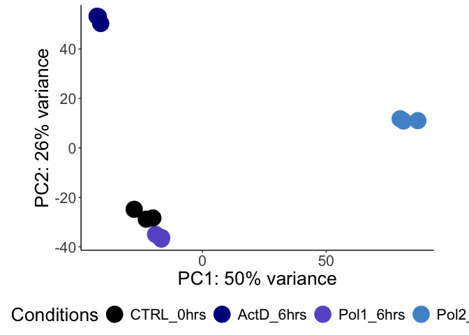<!-- -->

``` r
## Plot top PCAs for PCA2 and 3 
prTab %>% #PCA2_3_AllSamples_NOlabels ## pca.2.3.pol1only ## pca.2.3.pol1only.nolabels ## pca.2.3.nopol2 ## pca.2.3.nopol2.nolabels
  ggplot(aes(PC2, PC3, color = Conditions)) +
  geom_point(size = 5, alpha = 1) + theme_classic()+
  xlab(paste0("PC2: ", percentVar[2], "% variance")) + ylab(paste0("PC3: ", percentVar[3], "% variance")) + 
  scale_color_manual(values = c("black", "darkblue","slateblue", "steelblue3")) +
  coord_fixed() + geom_text_repel(aes(label = NA), size = 3, family = "Arial Narrow", hjust = 0)+
  theme(legend.position="bottom", plot.title = element_text(size=20), text = element_text(size=20, family="Arial"))
```

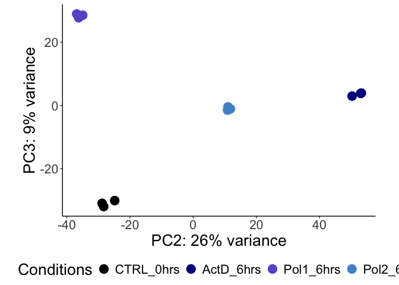<!-- -->

``` r
## Plot cumulative variance
b = barplot(percentVar, horiz = FALSE, las = 1, ylab = 'Variance (%)', ylim = c(0,105))
lines(b, cumuVar, type = 'b', col = 'red')
```

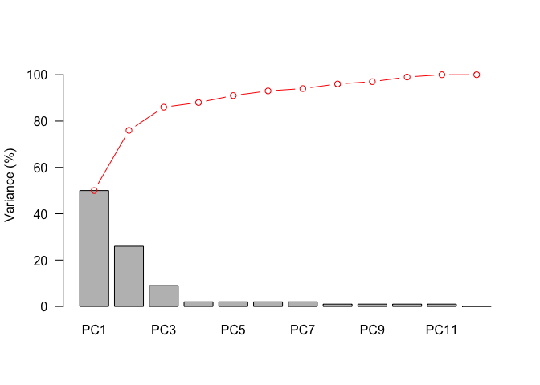<!-- -->

``` r
## Plot Eigens
eigenvalues = pca$sdev^2
plot(c(1:12), eigenvalues, xlab = 'Principal Components', ylab = 'eigenvalue', las = 1)
```

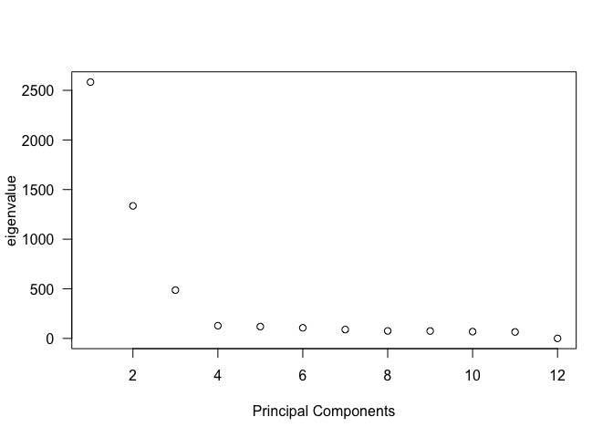<!-- -->

``` r
## determing which PCAs to keep based on: 
which(eigenvalues > mean(eigenvalues))
```

    ## [1] 1 2 3

#### Figure 3H: Heatmap for QC of count data

This snippet uses
[Pheatmap](https://www.rdocumentation.org/packages/pheatmap/versions/1.0.12/topics/pheatmap),
[Dendsort](https://cran.rstudio.com/web/packages/dendsort/index.html),
and the Pearson Correlation coefficients of the experiment samples to
generate a clustered heatmap with a dendrogram for experiment
conditions. The input for this is the dds object generated from calling
DESeq.

``` r
## Hierachal clustering map plot for sample QC
sort_hclust <- function(...) as.hclust(dendsort(as.dendrogram(...)))

## Extract the rlog matrix from the object
rld_mat <- assay(rld) ## All samples 

## Compute pairwise correlation values
rld_cor <- cor(rld_mat) 

colnames(rld_cor) <- c("ActD R1", "ActD R2", "ActD R3", "Pol1 R1", "Pol1 R2", "Pol1 R3", "Pol2 R1", "Pol2 R2", "Pol2 R3", "ctrl R1", "ctrl R2", "ctrl R3")
rownames(rld_cor) <- c("ActD R1", "ActD R2", "ActD R3", "Pol1 R1", "Pol1 R2", "Pol1 R3", "Pol2 R1", "Pol2 R2", "Pol2 R3", "ctrl R1", "ctrl R2", "ctrl R3")

## organize hierachal clusters
mat <- rld_cor
mat_cluster_cols <- hclust(dist(t(mat)))
mat_cluster_cols <- sort_hclust(mat_cluster_cols)
mat_cluster_rows <- sort_hclust(hclust(dist(mat)))
length(mat)
```

    ## [1] 144

``` r
## Color scales
colors <- colorRampPalette(c("#798234","white","#D46780"))(length(mat))

# plot heat map ## sample.corr.plot.nopol2 ## sample.corr.plot.pol1only
p<-pheatmap(mat, 
            color = colors,
            fontsize = 16,
            fontsize_row = 16, 
            fontsize_col = 16,
            cellwidth = 20,
            cellheight = 20,
            cluster_cols= mat_cluster_cols,
            cluster_rows= mat_cluster_rows,
            main = "",
            annotation_legend = TRUE,
            scale="row")
p
```

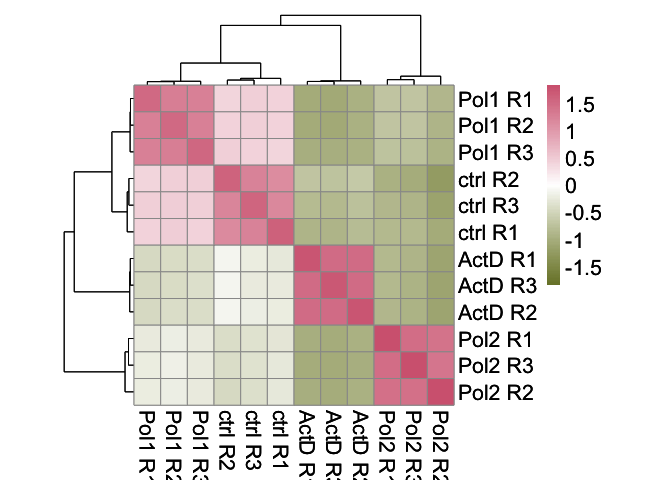<!-- -->

#### Differential expression analysis and ‘results’ matrices

In this section we generate the differential gene expression results
using the conditions and factors defined in an earlier step. After
running
[DESeq()](https://bioconductor.org/packages/release/bioc/html/DESeq2.html),
we generate results matrices for each contrast in the experiment.

``` r
## Generate DGE DESeqDataSet data frame
dds <- DESeq(dds)

## Which contrasts to use?
resultsNames(dds)
```

    ## [1] "Intercept"                         "Conditions_ActD_6hrs_vs_CTRL_0hrs"
    ## [3] "Conditions_Pol1_6hrs_vs_CTRL_0hrs" "Conditions_Pol2_6hrs_vs_CTRL_0hrs"

``` r
## Generate a results matrix for Treatment vs. Control with an alpha of 0.05
res.actd <- results(dds, contrast = c("Conditions","ActD_6hrs", "CTRL_0hrs"), alpha = 0.05)
res.pol1 <- results(dds, contrast = c("Conditions", "Pol1_6hrs", "CTRL_0hrs"), alpha = 0.05)
res.pol2 <- results(dds, contrast = c("Conditions", "Pol2_6hrs", "CTRL_0hrs"), alpha = 0.05)
```

#### Annotating the results using [Annotation Hub](https://bioconductor.org/packages/release/bioc/html/AnnotationHub.html)

Annotate_results() first uses [Annotation
Hub](https://bioconductor.org/packages/release/bioc/html/AnnotationHub.html)
to map ENSEMBL IDs to NCBI Gene Symbols. It then replaces NAs in the
dataset with (generated by DESeq2’s outlier identification algorithm
using Cook’s Distance) with psuedocounts of 1, as well as filtering out
NAs for unmapped ENSEMBL IDs. Finally, it orders the results and writes
them to a CSV in the results directory .

**Arguments:**

*results = the DESeq2 results object generated from DESeq::results()*  
*filename = a string that the CSV will be saves as*  
*transcript = boolean: RSEM transcripts? TRUE, RSEM genes? FALSE*

**Output:** *annotated results matrix*

``` r
## Annotate genes ## When using gene RSEM counts
res.actd <- Annotate_results(res.actd, "Conditions_ActD_6hrs_vs_CTRL_0hrs.genes", transcript=F)
res.pol1 <- Annotate_results(res.pol1, "Conditions_Pol1_6hrs_vs_CTRL_0hrs.genes", transcript=F)
res.pol2 <- Annotate_results(res.pol2, "Conditions_Pol2_6hrs_vs_CTRL_0hrs.genes", transcript=F)
```

#### Figure 3G: Build scatter plots of log fold change and counts

Here, we plot the log fold change of each condition against one of the
others

``` r
## Annotate for Up/downregulated
res.pol1.filtered <- Filter_Results(res.pol1)
res.pol2.filtered <- Filter_Results(res.pol2)
res.actd.filtered <- Filter_Results(res.actd)

##-------------------------------------------------------## For genes

pol1.df <- dplyr::select(res.pol1.filtered, baseMean, gene_id, log2FoldChange, padj, gene_biotype, diffexpressed)
pol2.df <- dplyr::select(res.pol2.filtered, baseMean, gene_id, log2FoldChange, padj, gene_biotype, diffexpressed)
actd.df <- dplyr::select(res.actd.filtered, baseMean, gene_id, log2FoldChange, padj, gene_biotype, diffexpressed)

## filter counts on DEG data
plot.1 <- merge(pol1.df, pol2.df, by = "gene_id")
plot.2 <- merge(pol1.df, actd.df, by = "gene_id")
plot.3 <- merge(pol2.df, actd.df, by = "gene_id")

## Plot each pair of LFC scatterplots
plotLFC(plot.1, x.lab = "Pol 1 LFC", y.lab = "Pol 2 LFC")
```

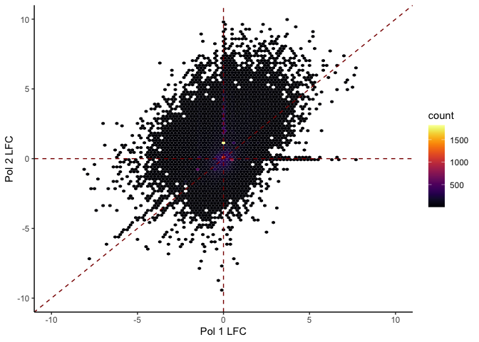<!-- -->

``` r
plotLFC(plot.2, x.lab = "Pol 1 LFC", y.lab = "ActD LFC")
```

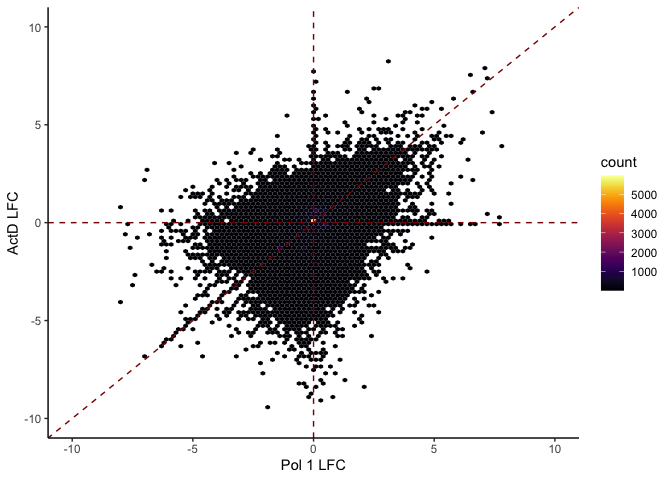<!-- -->

``` r
plotLFC(plot.3, x.lab = "Pol 2 LFC", y.lab = "ActD LFC")
```

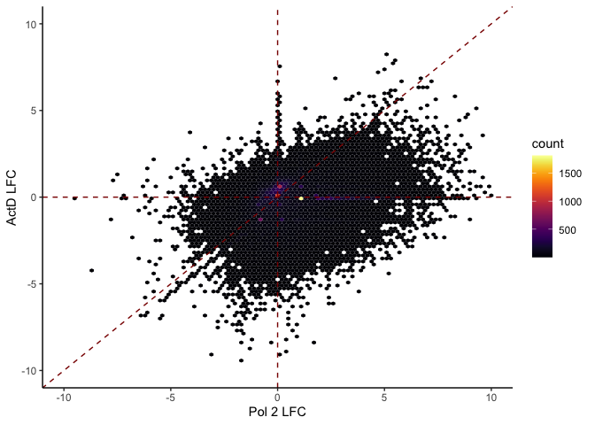<!-- -->

#### SI Figure 4A-C: MA Plot

Thisfunction, plot_MA(), uses base R, ggplot2, and
[apeglm](https://bioconductor.org/packages/release/bioc/html/apeglm.html)
to generate an [MA plot](https://en.wikipedia.org/wiki/MA_plot) of the
DGE results that show the mean count for each gene agains the log fold
change of each gene.

**Arguments**

*coef = the coefficient generated upon calling DEseq::resultsNames(dds)*
*title = plot title (string)*  
*results = the DESeq2 results object generated from DESeq::results()*  
*dn.col = color of downregulated genes*  
*up.col = color of upregulated genes*

**Output:** *MA plot*

``` r
## Find coefficients for following function
resultsNames(dds)
```

    ## [1] "Intercept"                         "Conditions_ActD_6hrs_vs_CTRL_0hrs"
    ## [3] "Conditions_Pol1_6hrs_vs_CTRL_0hrs" "Conditions_Pol2_6hrs_vs_CTRL_0hrs"

``` r
### Call function for results
plot_MA("Conditions_ActD_6hrs_vs_CTRL_0hrs", "Act D", res.actd) ## ma.plot.actd
```

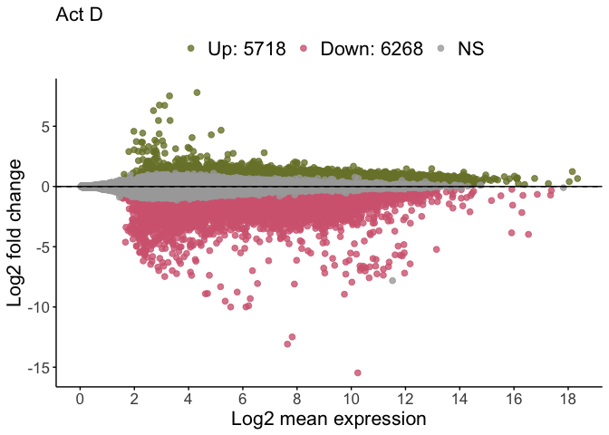<!-- -->

``` r
plot_MA("Conditions_Pol1_6hrs_vs_CTRL_0hrs", "Pol 1", res.pol1) ## ma.plot.pol1
```

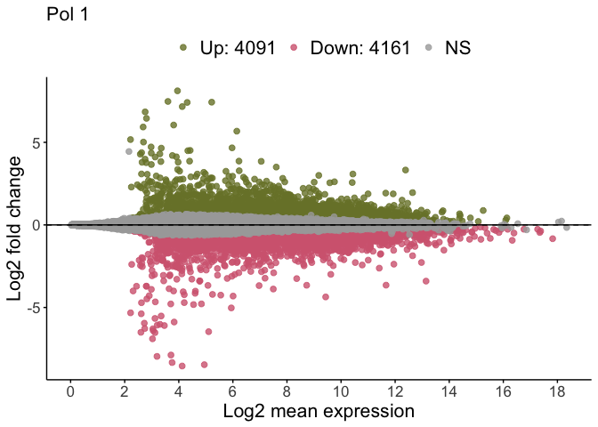<!-- -->

``` r
plot_MA("Conditions_Pol2_6hrs_vs_CTRL_0hrs", "Pol 2", res.pol2)
```

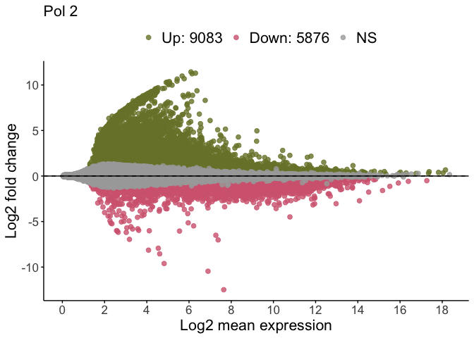<!-- -->

#### Base R Volacano plot of DESeq results

This function uses base R to generate a volcano plot of differentialy
expressed genes using the log fold change and p value cut-offs supplied
in the arguments. Before returning the plot, it saves a copy of the plot
to the designated directory.

DE_Vol_Plot \<- function(results, plt.title, lfc.up=0.58,
lfc.dwn=-0.58,pvadj=0.05, y.limits, x.limits=c(-7,7),dncol=“\#D46780”,
upcol=“\#798234”) { **Arguments**

*results = the DESeq2 results object generated from DESeq::results()*  
*plt.title = plot title (string)*  
*lfc.up = upregulated log fold change cut-off (numeric)*  
*lfc.dn = downregulated log fold change cut-off (numeric)*  
*padj = Pvalue adjusted cutoff*  
*y.limits = the y axis limit of the plot*  
*x.limits = the x axis limit of the plot*  
*dncol = color for downregulated genes*  
*upcol = color for upregulated genes*

**Output:** *Volcano plot*

lfc.up = positive integer (ex. 0.58, 1, 2)  
lfc.dwm = negative integer (ex. -0.58, -1, -2)  
pvadj = positive integer (ex. 0.01, 0.05. 0.1)

*To turn on labeling of individual DEGs, ‘label=delabel’ and
‘geom_text_repel’ need to be uncommented.*

``` r
### Call function for results
DE_Vol_Plot(res.actd,"ActD: Differentially Expressed Genes", y.limits=300) ## volplot.actd
DE_Vol_Plot(res.pol1,"Pol1: Differentially Expressed Genes", y.limits=300) ## volplot.pol1
DE_Vol_Plot(res.pol2,"Pol2: Differentially Expressed Genes",y.limits=300) ## volplot.pol2
```

#### Figures 3D-F: Get counts of transcript biotype for each condition

``` r
## Get sample metadata
sample <- read.table(file.path(root,dir.rsem, "metadata.csv"), sep= ",", header= TRUE)
newcolnames <-sample$Alias
sample
```

    ##                                          ID   Alias Conditions Replicate
    ## 1        ActD_6hrs_R1_S9.rsem.genes.results ActD_r1  ActD_6hrs         1
    ## 2       ActD_6hrs_R2_S10.rsem.genes.results ActD_r2  ActD_6hrs         2
    ## 3       ActD_6hrs_R3_S11.rsem.genes.results ActD_r3  ActD_6hrs         3
    ## 4    Pol1_8hrs_Aux_R1_S1.rsem.genes.results Pol1_r1  Pol1_6hrs         1
    ## 5    Pol1_8hrs_Aux_R2_S2.rsem.genes.results Pol1_r2  Pol1_6hrs         2
    ## 6    Pol1_8hrs_Aux_R3_S4.rsem.genes.results Pol1_r3  Pol1_6hrs         3
    ## 7    Pol2_8hrs_Aux_R1_S6.rsem.genes.results Pol2_r1  Pol2_6hrs         1
    ## 8    Pol2_8hrs_Aux_R2_S7.rsem.genes.results Pol2_r2  Pol2_6hrs         2
    ## 9    Pol2_8hrs_Aux_R3_S8.rsem.genes.results Pol2_r3  Pol2_6hrs         3
    ## 10 WT_HCT116_CTRL_R1_S12.rsem.genes.results  ctrl_1  CTRL_0hrs         1
    ## 11 WT_HCT116_CTRL_R2_S13.rsem.genes.results  ctrl_2  CTRL_0hrs         2
    ## 12 WT_HCT116_CTRL_R3_S14.rsem.genes.results  ctrl_3  CTRL_0hrs         3
    ##          Label
    ## 1  ActD_6hrs_1
    ## 2  ActD_6hrs_2
    ## 3  ActD_6hrs_3
    ## 4  Pol1_6hrs_1
    ## 5  Pol1_6hrs_2
    ## 6  Pol1_6hrs_3
    ## 7  Pol2_6hrs_1
    ## 8  Pol2_6hrs_2
    ## 9  Pol2_6hrs_3
    ## 10 CTRL_0hrs_1
    ## 11 CTRL_0hrs_2
    ## 12 CTRL_0hrs_3

``` r
files <- file.path(root,dir.rsem.txi, paste0(str_replace_all(sample$ID, "genes", "isoforms")))

cts<- tximport(files, type = "rsem", txIn = TRUE, txOut = TRUE)

## Move col names from sample info to counts matrix
colnames(cts$counts)<-newcolnames

#Replace any transcripts with length 0 with a 1
cts$length[cts$length == 0] <- 1

# logical test to see if ^ is true now
identical(sample$Alias, colnames(cts$counts))
```

    ## [1] TRUE

``` r
# Store the file names in the sample info matrix as row names
row.names(sample) <- sample$Alias
head(sample, n=10)
```

    ##                                               ID   Alias Conditions Replicate
    ## ActD_r1       ActD_6hrs_R1_S9.rsem.genes.results ActD_r1  ActD_6hrs         1
    ## ActD_r2      ActD_6hrs_R2_S10.rsem.genes.results ActD_r2  ActD_6hrs         2
    ## ActD_r3      ActD_6hrs_R3_S11.rsem.genes.results ActD_r3  ActD_6hrs         3
    ## Pol1_r1   Pol1_8hrs_Aux_R1_S1.rsem.genes.results Pol1_r1  Pol1_6hrs         1
    ## Pol1_r2   Pol1_8hrs_Aux_R2_S2.rsem.genes.results Pol1_r2  Pol1_6hrs         2
    ## Pol1_r3   Pol1_8hrs_Aux_R3_S4.rsem.genes.results Pol1_r3  Pol1_6hrs         3
    ## Pol2_r1   Pol2_8hrs_Aux_R1_S6.rsem.genes.results Pol2_r1  Pol2_6hrs         1
    ## Pol2_r2   Pol2_8hrs_Aux_R2_S7.rsem.genes.results Pol2_r2  Pol2_6hrs         2
    ## Pol2_r3   Pol2_8hrs_Aux_R3_S8.rsem.genes.results Pol2_r3  Pol2_6hrs         3
    ## ctrl_1  WT_HCT116_CTRL_R1_S12.rsem.genes.results  ctrl_1  CTRL_0hrs         1
    ##               Label
    ## ActD_r1 ActD_6hrs_1
    ## ActD_r2 ActD_6hrs_2
    ## ActD_r3 ActD_6hrs_3
    ## Pol1_r1 Pol1_6hrs_1
    ## Pol1_r2 Pol1_6hrs_2
    ## Pol1_r3 Pol1_6hrs_3
    ## Pol2_r1 Pol2_6hrs_1
    ## Pol2_r2 Pol2_6hrs_2
    ## Pol2_r3 Pol2_6hrs_3
    ## ctrl_1  CTRL_0hrs_1

``` r
#factor out dependencies
sample$Conditions <- factor(sample$Conditions, levels = c("CTRL_0hrs","ActD_6hrs","Pol1_6hrs","Pol2_6hrs"))
sample<- mutate(sample, Conditions = fct_relevel(Conditions, c( "CTRL_0hrs","ActD_6hrs","Pol1_6hrs","Pol2_6hrs")))
sample$Label <- factor(sample$Label, levels = dput(as.character(unique(sample$Label))))
```

    ## c("ActD_6hrs_1", "ActD_6hrs_2", "ActD_6hrs_3", "Pol1_6hrs_1", 
    ## "Pol1_6hrs_2", "Pol1_6hrs_3", "Pol2_6hrs_1", "Pol2_6hrs_2", "Pol2_6hrs_3", 
    ## "CTRL_0hrs_1", "CTRL_0hrs_2", "CTRL_0hrs_3")

``` r
## Create DDS object using RSEM counts
dds <- DESeqDataSetFromTximport(cts, colData = sample, design = ~ Conditions)

## Pre-filtering the dataset
nrow(dds)
```

    ## [1] 252989

``` r
dds <- dds[ rowSums(counts(dds)) > 0, ]
nrow(dds)
```

    ## [1] 185585

``` r
## Generate DGE DESeqDataSet data frame
dds <- DESeq(dds)

## Generate a results matrix for Treatment vs. Control with an alpha of 0.05
res.actd <- results(dds, contrast = c("Conditions","ActD_6hrs", "CTRL_0hrs"), alpha = 0.05)
res.pol1 <- results(dds, contrast = c("Conditions", "Pol1_6hrs", "CTRL_0hrs"), alpha = 0.05)
res.pol2 <- results(dds, contrast = c("Conditions", "Pol2_6hrs", "CTRL_0hrs"), alpha = 0.05)

## Annotate transcripts ## When using transcript RSEM counts
res.actd <- Annotate_results(res.actd, "Conditions_ActD_6hrs_vs_CTRL_0hrs.tx", transcript=T)
res.pol1 <- Annotate_results(res.pol1, "Conditions_Pol1_6hrs_vs_CTRL_0hrs.tx", transcript=T)
res.pol2 <- Annotate_results(res.pol2, "Conditions_Pol2_6hrs_vs_CTRL_0hrs.tx", transcript=T)

##-------------------------------------------------------## transcript Annotation with further info

## Annotate for Up/downregulated
res.pol1.filtered <- Filter_Results(res.pol1)
res.pol2.filtered <- Filter_Results(res.pol2)
res.actd.filtered <- Filter_Results(res.actd)

pol1.anno <- annotate.peak(res.pol1.filtered)
```

    ## >> preparing features information...      2024-10-09 17:07:27 
    ## >> identifying nearest features...        2024-10-09 17:07:27 
    ## >> calculating distance from peak to TSS...   2024-10-09 17:07:30 
    ## >> assigning genomic annotation...        2024-10-09 17:07:30 
    ## >> assigning chromosome lengths           2024-10-09 17:07:53 
    ## >> done...                    2024-10-09 17:07:53

``` r
pol2.anno <- annotate.peak(res.pol1.filtered)
```

    ## >> preparing features information...      2024-10-09 17:07:53 
    ## >> identifying nearest features...        2024-10-09 17:07:53 
    ## >> calculating distance from peak to TSS...   2024-10-09 17:07:55 
    ## >> assigning genomic annotation...        2024-10-09 17:07:55 
    ## >> assigning chromosome lengths           2024-10-09 17:08:01 
    ## >> done...                    2024-10-09 17:08:01

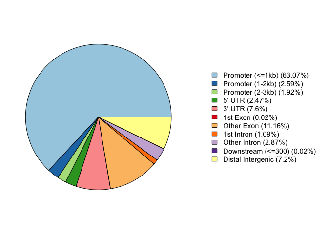<!-- -->

``` r
actd.anno <- annotate.peak(res.actd.filtered)
```

    ## >> preparing features information...      2024-10-09 17:08:02 
    ## >> identifying nearest features...        2024-10-09 17:08:02 
    ## >> calculating distance from peak to TSS...   2024-10-09 17:08:04 
    ## >> assigning genomic annotation...        2024-10-09 17:08:04 
    ## >> assigning chromosome lengths           2024-10-09 17:08:09 
    ## >> done...                    2024-10-09 17:08:09

``` r
##-------------------------------------------------------## Plot Figures 3D-F

## get table of number of DEGs up and down
feat_tbl.1 <-res.pol1.filtered  %>% group_by(tx_biotype) %>% 
  reframe(down = as.numeric(-sum(down)), up = as.numeric(sum(up))) 
  
feat_tbl.2 <- res.actd.filtered  %>% group_by(tx_biotype) %>% 
  reframe(down = as.numeric(-sum(down)), up = as.numeric(sum(up))) 

feat_tbl.3 <- res.pol2.filtered  %>% group_by(tx_biotype) %>% 
  reframe(down = as.numeric(-sum(down)), up = as.numeric(sum(up))) 

## clean up data for plotting
feat_tbl.1$name <- rep("Pol 1", nrow(feat_tbl.1))
feat_tbl.2$name <- rep("ActD", nrow(feat_tbl.2))
feat_tbl.3$name <- rep("Pol 2", nrow(feat_tbl.3))

## Gather Pol 1 data for plotting
tbl <- gather(feat_tbl.1, diff, sum, 2:3)
tbl <- tbl[tbl$sum != 0,]
tbl <- tbl[abs(tbl$sum) > 25,]

## # deg.summary.pol1 ## deg.tx.summary.pol1
tbl %>% 
  ggplot(aes(x=reorder(tx_biotype, -abs(sum)), y=as.numeric(sum) , fill=diff, color = "black"), group_by(tx_biotype)) +
  scale_y_continuous(breaks = c(seq(min(as.numeric(tbl$sum)), 0, by =1000), seq(0, max(as.numeric(tbl$sum)),by =1000))  ,limits=c(min(as.numeric(tbl$sum)), max(as.numeric(tbl$sum)))) + 
  geom_bar(stat="identity", width=0.75, position = "stack", alpha = 1) +
  scale_color_manual(values=c("black","black"))+
  scale_fill_manual(values=c("#D46780","#798234")) + theme_classic()+
  scale_x_discrete(expand = c(0.09, 0.09))+
  theme(axis.text.x = element_text(angle = 45,  hjust=1), legend.position="", plot.title = element_text(size=16), text = element_text(size=16, family="Arial"))+
  guides(fill = guide_legend(title = "Transcript Type"))+ ylab("Number of DEGs") + xlab("")+ ggtitle(paste0("Pol 1"))
```

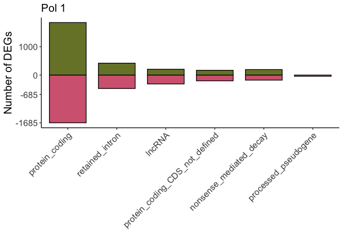<!-- -->

``` r
## Gather Pol 2 data for plotting
tbl <- gather(feat_tbl.2, diff, sum, 2:3)
tbl <- tbl[tbl$sum != 0,]
tbl <- tbl[abs(tbl$sum) > 25,]

## # deg.summary.pol2 ## deg.tx.summary.pol2
tbl %>% 
  ggplot(aes(x=reorder(tx_biotype, -abs(sum)), y=as.numeric(sum) , fill=diff, color = "black"), group_by(tx_biotype)) +
  scale_y_continuous(breaks = c(seq(min(as.numeric(tbl$sum)), 0, by =1000), seq(0, max(as.numeric(tbl$sum)),by =1000))  ,limits=c(min(as.numeric(tbl$sum)), max(as.numeric(tbl$sum)))) + 
  geom_bar(stat="identity", width=0.75, position = "stack", alpha = 1) +
  scale_color_manual(values=c("black","black"))+
  scale_fill_manual(values=c("#D46780","#798234")) + theme_classic()+
  scale_x_discrete(expand = c(0.09, 0.09))+
  theme(axis.text.x = element_text(angle = 45,  hjust=1), legend.position="", plot.title = element_text(size=16), text = element_text(size=16, family="Arial"))+
  guides(fill = guide_legend(title = "Transcript Type"))+ ylab("Number of DEGs") + xlab("")+ ggtitle(paste0("Pol 2"))
```

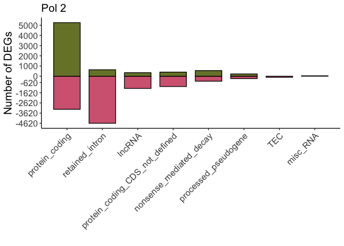<!-- -->

``` r
## Gather ActD data for plotting
tbl <- gather(feat_tbl.3, diff, sum, 2:3)
tbl <- tbl[tbl$sum != 0,]
tbl <- tbl[abs(tbl$sum) > 25,]

## # deg.summary.actd ## deg.tx.summary.actd
tbl %>% 
  ggplot(aes(x=reorder(tx_biotype, -abs(sum)), y=as.numeric(sum) , fill=diff, color = "black"), group_by(tx_biotype)) +
  scale_y_continuous(breaks = c(seq(min(as.numeric(tbl$sum)), 0, by =1000), seq(0, max(as.numeric(tbl$sum)),by =1000))  ,limits=c(min(as.numeric(tbl$sum)), max(as.numeric(tbl$sum)))) + 
  geom_bar(stat="identity", width=0.75, position = "stack", alpha = 1) +
  scale_color_manual(values=c("black","black"))+
  scale_fill_manual(values=c("#D46780","#798234")) + theme_classic()+
  scale_x_discrete(expand = c(0.09, 0.09))+
  theme(axis.text.x = element_text(angle = 45,  hjust=1), legend.position="", plot.title = element_text(size=16), text = element_text(size=16, family="Arial"))+
  guides(fill = guide_legend(title = "Transcript Type"))+ ylab("Number of DEGs") + xlab("")+ ggtitle(paste0("ActD"))
```

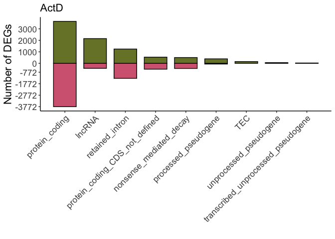<!-- -->

``` r
utils::sessionInfo()
```

    ## R version 4.3.3 (2024-02-29)
    ## Platform: x86_64-apple-darwin20 (64-bit)
    ## Running under: macOS Sonoma 14.2.1
    ## 
    ## Matrix products: default
    ## BLAS:   /Library/Frameworks/R.framework/Versions/4.3-x86_64/Resources/lib/libRblas.0.dylib 
    ## LAPACK: /Library/Frameworks/R.framework/Versions/4.3-x86_64/Resources/lib/libRlapack.dylib;  LAPACK version 3.11.0
    ## 
    ## locale:
    ## [1] en_US.UTF-8/en_US.UTF-8/en_US.UTF-8/C/en_US.UTF-8/en_US.UTF-8
    ## 
    ## time zone: America/Los_Angeles
    ## tzcode source: internal
    ## 
    ## attached base packages:
    ## [1] stats4    stats     graphics  grDevices utils     datasets  methods  
    ## [8] base     
    ## 
    ## other attached packages:
    ##  [1] plyranges_1.22.0                      
    ##  [2] TxDb.Hsapiens.UCSC.hg38.refGene_3.18.0
    ##  [3] ChIPseeker_1.38.0                     
    ##  [4] apeglm_1.24.0                         
    ##  [5] ensembldb_2.26.0                      
    ##  [6] AnnotationFilter_1.26.0               
    ##  [7] GenomicFeatures_1.54.4                
    ##  [8] AnnotationDbi_1.64.1                  
    ##  [9] AnnotationHub_3.10.1                  
    ## [10] BiocFileCache_2.10.2                  
    ## [11] dbplyr_2.5.0                          
    ## [12] ggside_0.3.1                          
    ## [13] ggpubr_0.6.0                          
    ## [14] tidyr_1.3.1                           
    ## [15] dendsort_0.3.4                        
    ## [16] viridis_0.6.5                         
    ## [17] viridisLite_0.4.2                     
    ## [18] pheatmap_1.0.12                       
    ## [19] ggrepel_0.9.5                         
    ## [20] stringr_1.5.1                         
    ## [21] forcats_1.0.0                         
    ## [22] tximport_1.30.0                       
    ## [23] magrittr_2.0.3                        
    ## [24] dplyr_1.1.4                           
    ## [25] ggplot2_3.5.1                         
    ## [26] DESeq2_1.42.1                         
    ## [27] SummarizedExperiment_1.32.0           
    ## [28] Biobase_2.62.0                        
    ## [29] MatrixGenerics_1.14.0                 
    ## [30] matrixStats_1.3.0                     
    ## [31] GenomicRanges_1.54.1                  
    ## [32] GenomeInfoDb_1.38.8                   
    ## [33] IRanges_2.36.0                        
    ## [34] S4Vectors_0.40.2                      
    ## [35] BiocGenerics_0.48.1                   
    ## 
    ## loaded via a namespace (and not attached):
    ##   [1] splines_4.3.3                          
    ##   [2] later_1.3.2                            
    ##   [3] BiocIO_1.12.0                          
    ##   [4] bitops_1.0-7                           
    ##   [5] ggplotify_0.1.2                        
    ##   [6] filelock_1.0.3                         
    ##   [7] tibble_3.2.1                           
    ##   [8] polyclip_1.10-6                        
    ##   [9] XML_3.99-0.16.1                        
    ##  [10] lifecycle_1.0.4                        
    ##  [11] rstatix_0.7.2                          
    ##  [12] lattice_0.22-6                         
    ##  [13] vroom_1.6.5                            
    ##  [14] MASS_7.3-60.0.1                        
    ##  [15] backports_1.5.0                        
    ##  [16] rmarkdown_2.27                         
    ##  [17] plotrix_3.8-4                          
    ##  [18] yaml_2.3.8                             
    ##  [19] httpuv_1.6.15                          
    ##  [20] cowplot_1.1.3                          
    ##  [21] DBI_1.2.3                              
    ##  [22] RColorBrewer_1.1-3                     
    ##  [23] abind_1.4-5                            
    ##  [24] zlibbioc_1.48.2                        
    ##  [25] purrr_1.0.2                            
    ##  [26] ggraph_2.2.1                           
    ##  [27] RCurl_1.98-1.14                        
    ##  [28] yulab.utils_0.1.4                      
    ##  [29] tweenr_2.0.3                           
    ##  [30] rappdirs_0.3.3                         
    ##  [31] GenomeInfoDbData_1.2.11                
    ##  [32] enrichplot_1.22.0                      
    ##  [33] tidytree_0.4.6                         
    ##  [34] codetools_0.2-20                       
    ##  [35] DelayedArray_0.28.0                    
    ##  [36] DOSE_3.28.2                            
    ##  [37] ggforce_0.4.2                          
    ##  [38] xml2_1.3.6                             
    ##  [39] tidyselect_1.2.1                       
    ##  [40] aplot_0.2.3                            
    ##  [41] farver_2.1.2                           
    ##  [42] jsonlite_1.8.8                         
    ##  [43] GenomicAlignments_1.38.2               
    ##  [44] tidygraph_1.3.1                        
    ##  [45] bbmle_1.0.25.1                         
    ##  [46] tools_4.3.3                            
    ##  [47] progress_1.2.3                         
    ##  [48] treeio_1.26.0                          
    ##  [49] TxDb.Hsapiens.UCSC.hg19.knownGene_3.2.2
    ##  [50] Rcpp_1.0.12                            
    ##  [51] glue_1.7.0                             
    ##  [52] gridExtra_2.3                          
    ##  [53] SparseArray_1.2.4                      
    ##  [54] xfun_0.45                              
    ##  [55] qvalue_2.34.0                          
    ##  [56] withr_3.0.0                            
    ##  [57] numDeriv_2016.8-1.1                    
    ##  [58] BiocManager_1.30.23                    
    ##  [59] fastmap_1.2.0                          
    ##  [60] boot_1.3-30                            
    ##  [61] fansi_1.0.6                            
    ##  [62] caTools_1.18.2                         
    ##  [63] digest_0.6.35                          
    ##  [64] R6_2.5.1                               
    ##  [65] mime_0.12                              
    ##  [66] gridGraphics_0.5-1                     
    ##  [67] colorspace_2.1-0                       
    ##  [68] GO.db_3.18.0                           
    ##  [69] gtools_3.9.5                           
    ##  [70] biomaRt_2.58.2                         
    ##  [71] RSQLite_2.3.7                          
    ##  [72] utf8_1.2.4                             
    ##  [73] generics_0.1.3                         
    ##  [74] hexbin_1.28.3                          
    ##  [75] data.table_1.15.4                      
    ##  [76] rtracklayer_1.62.0                     
    ##  [77] graphlayouts_1.1.1                     
    ##  [78] prettyunits_1.2.0                      
    ##  [79] httr_1.4.7                             
    ##  [80] S4Arrays_1.2.1                         
    ##  [81] scatterpie_0.2.3                       
    ##  [82] pkgconfig_2.0.3                        
    ##  [83] gtable_0.3.5                           
    ##  [84] blob_1.2.4                             
    ##  [85] XVector_0.42.0                         
    ##  [86] shadowtext_0.1.3                       
    ##  [87] htmltools_0.5.8.1                      
    ##  [88] carData_3.0-5                          
    ##  [89] fgsea_1.28.0                           
    ##  [90] ProtGenerics_1.34.0                    
    ##  [91] scales_1.3.0                           
    ##  [92] png_0.1-8                              
    ##  [93] ggfun_0.1.5                            
    ##  [94] knitr_1.47                             
    ##  [95] rstudioapi_0.16.0                      
    ##  [96] reshape2_1.4.4                         
    ##  [97] tzdb_0.4.0                             
    ##  [98] rjson_0.2.21                           
    ##  [99] nlme_3.1-165                           
    ## [100] coda_0.19-4.1                          
    ## [101] curl_5.2.1                             
    ## [102] bdsmatrix_1.3-7                        
    ## [103] cachem_1.1.0                           
    ## [104] KernSmooth_2.23-24                     
    ## [105] BiocVersion_3.18.1                     
    ## [106] HDO.db_0.99.1                          
    ## [107] parallel_4.3.3                         
    ## [108] restfulr_0.0.15                        
    ## [109] pillar_1.9.0                           
    ## [110] grid_4.3.3                             
    ## [111] vctrs_0.6.5                            
    ## [112] gplots_3.1.3.1                         
    ## [113] promises_1.3.0                         
    ## [114] car_3.1-2                              
    ## [115] xtable_1.8-4                           
    ## [116] evaluate_0.24.0                        
    ## [117] readr_2.1.5                            
    ## [118] mvtnorm_1.2-5                          
    ## [119] cli_3.6.2                              
    ## [120] locfit_1.5-9.9                         
    ## [121] compiler_4.3.3                         
    ## [122] Rsamtools_2.18.0                       
    ## [123] rlang_1.1.4                            
    ## [124] crayon_1.5.2                           
    ## [125] ggsignif_0.6.4                         
    ## [126] labeling_0.4.3                         
    ## [127] emdbook_1.3.13                         
    ## [128] plyr_1.8.9                             
    ## [129] fs_1.6.4                               
    ## [130] stringi_1.8.4                          
    ## [131] BiocParallel_1.36.0                    
    ## [132] munsell_0.5.1                          
    ## [133] Biostrings_2.70.3                      
    ## [134] lazyeval_0.2.2                         
    ## [135] GOSemSim_2.28.1                        
    ## [136] Matrix_1.6-5                           
    ## [137] hms_1.1.3                              
    ## [138] patchwork_1.2.0                        
    ## [139] bit64_4.0.5                            
    ## [140] KEGGREST_1.42.0                        
    ## [141] shiny_1.8.1.1                          
    ## [142] interactiveDisplayBase_1.40.0          
    ## [143] highr_0.11                             
    ## [144] igraph_2.0.3                           
    ## [145] broom_1.0.6                            
    ## [146] memoise_2.0.1                          
    ## [147] ggtree_3.10.1                          
    ## [148] fastmatch_1.1-4                        
    ## [149] bit_4.0.5                              
    ## [150] ape_5.8
